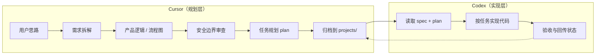

# discussionGroup

个人**思路 → 需求 → 规划**归档仓库。讨论在 **Cursor** 中完成拆解与可视化；**Codex** 按本仓库产出的 spec / plan 执行开发。

---

## 工作流



| 阶段 | 工具 | 产出物 |
|------|------|--------|
| 讨论与澄清 | Cursor | `projects/<slug>/ideas/` |
| 产品定义 | Cursor | `projects/<slug>/product/spec.md` |
| 安全与边界 | Cursor | spec 内「安全与边界」章节 |
| 开发任务包 | Cursor | `projects/<slug>/plans/plan.md` |
| 代码实现 | Codex | 目标业务代码仓库（非本仓库） |

**原则：** 本仓库只存文档与图表，不存业务实现代码。每个产品/项目拥有**独立大文件夹**，见 [agent.md](./agent.md)。

---

## 目录结构

```
discussionGroup/
├── agent.md                      # Agent 完整操作指南（Cursor 必读）
├── README.md                     # 本文件：工作流与项目索引
└── projects/                     # 【核心】所有项目归档
    ├── README.md                 # 项目目录说明 + 项目列表
    └── <project-slug>/           # 单个项目大文件夹
        ├── README.md             # 【必填】项目入口索引
        ├── ideas/                # 讨论记录
        ├── product/spec.md       # 产品规格
        ├── plans/plan.md         # Codex 任务规划
        ├── tech/architecture.md  # 技术架构
        ├── business/             # 商业分析（可选）
        ├── decisions/            # ADR
        ├── questions/            # 开放问题
        └── archive/              # 废弃文档
```

---

## 文档成熟度

| 等级 | 状态 | 能否交给 Codex |
|------|------|----------------|
| L0 灵感 | 探索中 | 否 |
| L1 方向 | 待验证 | 否 |
| L2 产品定义 | 有结论 | 需先写 plan |
| L3 可开发包 | 可开发 | **是**（spec + plan 齐全） |

详见 [agent.md](./agent.md) 中的等级定义与模板。

---

## 可视化要求（摘要）

功能进入 `product/spec.md` 后，文档中应包含：

1. **产品逻辑图** — 模块/角色/数据关系（`graph`）
2. **主流程图** — 用户或系统主路径（`flowchart`）
3. **状态图**（如适用）— 订单、审批、生命周期（`stateDiagram-v2`）
4. **时序图**（如适用）— 多系统/API 协作（`sequenceDiagram`）

完整规范见 [agent.md § 可视化规范](./agent.md#可视化规范必须)。

---

## 安全边界（摘要）

Cursor 在 spec / plan 中**必须**文档化：身份权限、数据存储、禁止项、审计与失败处理。

Codex 实现时以 plan 内 **「安全约束」** 为硬边界，不得自行放宽。

完整红线列表见 [agent.md § 安全边界](./agent.md#安全边界坚定执行)。

---

## 项目索引

> 每个项目有独立文件夹与 README；新建项目时在此追加一行。

| 项目 | 目录 | Spec | Plan | 状态 |
|------|------|------|------|------|
| RepPilot 医药代表智能助手 | [pharma-rep-agent](./projects/pharma-rep-agent/) | [spec](./projects/pharma-rep-agent/product/spec.md) | [plan](./projects/pharma-rep-agent/plans/plan.md) | L2 有结论 |

完整项目列表见 [projects/README.md](./projects/README.md)。

---

## 给 Codex 的快速上手

1. 进入 `projects/<project-slug>/`，阅读该项目 **README.md**
2. 打开 `plans/plan.md`，确认状态为 **可开发**
3. 阅读 `product/spec.md`，对照逻辑图与流程图理解范围
4. 参照 `tech/architecture.md` 落地技术方案
5. 严格遵守 plan 中的 **安全约束** 与 **Out of Scope**
6. 完成后更新 plan 勾选状态与项目 README 状态

---

## 给 Cursor Agent 的快速上手

1. 阅读 [agent.md](./agent.md) 全文
2. **新建项目**：创建 `projects/<slug>/` + 项目 `README.md`，更新本文件与 `projects/README.md`
3. **已有项目**：文档写入对应项目目录，更新项目 README 索引
4. 向用户说明：归档路径、是否可交 Codex、待确认项
5. **仅在用户要求时** git commit / push

---

## 远程仓库

`git@github.com:AliceDel66/discussionGroup.git`
