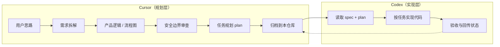

# discussionGroup

个人**思路 → 需求 → 规划**归档仓库。讨论在 **Cursor** 中完成拆解与可视化；**Codex** 按本仓库产出的 spec / plan 执行开发。

---

## 工作流



| 阶段 | 工具 | 产出物 |
|------|------|--------|
| 讨论与澄清 | Cursor | 讨论记录、`ideas/` |
| 产品定义 | Cursor | `product/specs/`（含逻辑图、流程图、状态图） |
| 安全与边界 | Cursor | spec 内「安全与边界」章节 |
| 开发任务包 | Cursor | `plans/*-plan.md`（分阶段任务 + 验收标准） |
| 代码实现 | Codex | 目标业务代码仓库（非本仓库） |

**原则：** 本仓库只存文档与图表，不存业务实现代码。Cursor 默认不改代码仓库；Codex 默认不扩展未写入 spec 的需求。

---

## 目录结构

```
discussionGroup/
├── agent.md                 # Agent 完整操作指南（Cursor 必读）
├── README.md                # 本文件：工作流与索引
├── ideas/                   # L0 灵感，尚未形成 spec
├── product/
│   └── specs/               # L2+ 功能规格（含 Mermaid 图）
├── plans/                   # L3 Codex 任务规划
├── tech/
│   └── architecture/        # 系统/模块边界图（可选）
├── business/
├── research/
├── decisions/               # ADR 决策记录
├── questions/
└── archive/
```

### 各目录说明

| 目录 | 成熟度 | 内容要求 |
|------|--------|----------|
| `ideas/` | L0 | 简短背景 + 开放问题，可无图 |
| `product/specs/` | L2–L3 | **必须有**产品逻辑图、主流程图；L3 需完整安全章节 |
| `plans/` | L3 | 可执行任务表、Phase、验收标准、安全约束 |
| `tech/architecture/` | — | 跨功能的架构/context 图 |
| `decisions/` | — | 重大取舍的 ADR，并链接影响的 spec |
| `questions/` | — | 待下次讨论的问题池 |
| `archive/` | — | 已废弃但保留历史的 spec/plan |

---

## 文档成熟度

| 等级 | 状态 | 能否交给 Codex |
|------|------|----------------|
| L0 灵感 | 探索中 | 否 |
| L1 方向 | 待验证 | 否 |
| L2 产品定义 | 有结论 | 需先写 plan |
| L3 可开发包 | 可开发 | **是**（spec + plan 齐全） |

详见 [agent.md](./agent.md) 中的等级定义与模板。

---

## 可视化要求（摘要）

功能进入 `product/specs/` 后，文档中应包含：

1. **产品逻辑图** — 模块/角色/数据关系（`graph`）
2. **主流程图** — 用户或系统主路径（`flowchart`）
3. **状态图**（如适用）— 订单、审批、生命周期（`stateDiagram-v2`）
4. **时序图**（如适用）— 多系统/API 协作（`sequenceDiagram`）

图表使用 Mermaid，直接写在 Markdown 内。完整规范见 [agent.md § 可视化规范](./agent.md#可视化规范必须)。

---

## 安全边界（摘要）

Cursor 在 spec / plan 中**必须**文档化：

- 身份、权限、最小授权
- 数据存储、可见性、 retention
- 禁止项（未明确授权则不做）
- 审计与失败处理

Codex 实现时以 plan 内 **「安全约束」** 为硬边界，不得自行放宽。

完整红线列表见 [agent.md § 安全边界](./agent.md#安全边界坚定执行)。

---

## 功能索引

> 随讨论补充；新 spec 归档后在此添加一行。

| 功能 | Spec | Plan | 状态 |
|------|------|------|------|
| — | — | — | — |

---

## 讨论记录索引

> 按时间倒序；详见各子目录 README。

| 日期 | 主题 | 路径 | 等级 |
|------|------|------|------|
| — | — | — | — |

---

## 给 Codex 的快速上手

1. 打开 `plans/<feature>-plan.md`，确认状态为 **可开发**。
2. 阅读链接的 `product/specs/<feature>.md`，对照逻辑图与流程图理解范围。
3. 严格遵守 plan 中的 **安全约束** 与 **Out of Scope**。
4. 按 Phase / 任务 ID 顺序实现，以表格中的 **验收标准** 为完成定义。
5. 完成后更新 plan 勾选状态，若有偏差在 spec 或 plan 中注明。

---

## 给 Cursor Agent 的快速上手

1. 阅读 [agent.md](./agent.md) 全文。
2. 每次讨论结束：归档讨论记录；若达 L2+ 则写 spec（含图）；若达 L3 则写 plan。
3. 更新本 README 的「功能索引」或子目录 README。
4. 向用户说明：归档路径、图表产出、是否可交 Codex、待确认项。
5. **仅在用户要求时** git commit / push。

---

## 远程仓库

`git@github.com:AliceDel66/discussionGroup.git`
