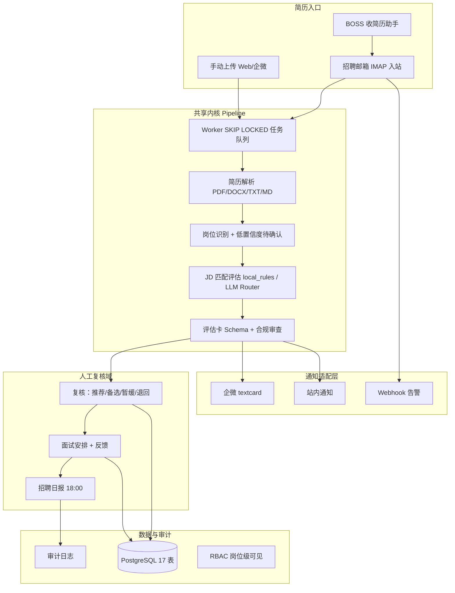
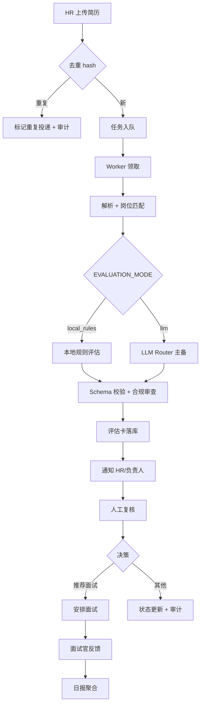
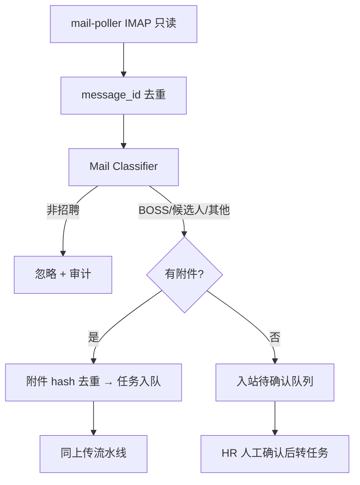
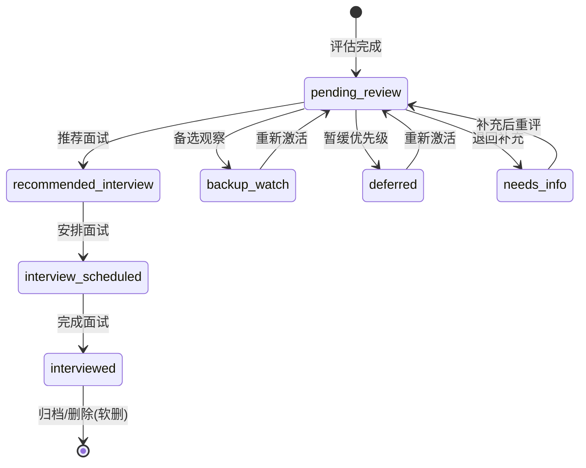

# 曜承 HR Agent — 招聘初筛与面试辅助 Agent

- **版本**：一期 v1.0（工程完结）/ 产品总纲 v0.4
- **日期**：2026-07-06
- **状态**：一期工程完结；真实试点 release gate HOLD
- **等级**：L3
- **关键词**：HR Agent、招聘初筛、企微、独立 Web、邮箱入站、BOSS、评估卡、人工复核

**权威来源（代码仓库，冲突时以较新文档为准）：**

- 一期范围与验收：[`doc/current/product/曜承_HR_Agent_企业微信内部应用版_一期_PRD_v1.1.md`](../../../../Ai/hr—agent/doc/current/product/曜承_HR_Agent_企业微信内部应用版_一期_PRD_v1.1.md)
- 双版本架构：[`doc/current/plan/曜承_HR_Agent_一期_双版本总体方案_v1.0.md`](../../../../Ai/hr—agent/doc/current/plan/曜承_HR_Agent_一期_双版本总体方案_v1.0.md)
- 工程完结报告：[`hr-agent-app/docs/phase1-completion-report.md`](../../../../Ai/hr—agent/hr-agent-app/docs/phase1-completion-report.md)

---

## 1. 背景与目标

### 1.1 用户原意

企业招聘中简历量大、初筛耗时长、评分标准不一致、面试准备不足、渠道分散（BOSS / 邮箱 / 内推 / 微信）。曜承 HR Agent 用 AI Agent 完成「接收 → 结构化 → JD 匹配 → 风险识别 → 面试问题 → 人工复核 → 沉淀」，**不替代人的最终决策**。

### 1.2 要解决的问题

| 痛点 | 现状 | 产品应对 |
|------|------|----------|
| 初筛耗时长 | 单份 10–15 分钟 | AI 评估卡 + 证据引用，人工 3–5 分钟复核 |
| 渠道分散 | BOSS / 邮箱 / 手动各自割裂 | 双入口 + BOSS 助手 + 统一候选人域 |
| 评分不一致 | 依赖个人经验 | 岗位 JD + 维度权重 + Schema 稳定输出 |
| 面试准备不足 | 问题泛泛 | 针对风险点/亮点生成验证型问题 |
| 合规顾虑 | 担心 AI 误发/误读 | 零 SMTP、权限隔离、审计、敏感字段不进评分 |
| 触达依赖企微 | 未用企微的客户无法试用 | 独立 Web 版平行交付 |

### 1.3 成功指标（一期试点期）

| 指标 | 目标 |
|------|------|
| 端到端处理（上传/收件 → 评估卡） | P95 ≤ 5 分钟 |
| 邮箱新邮件发现延迟 | ≤ 5 分钟（轮询默认 2 分钟） |
| BOSS 简历邮件识别准确率 | ≥ 95% |
| 非简历误建候选人率 | ≤ 2% |
| 评估卡 Schema 通过率 | ≥ 98% |
| 单份初筛人工耗时 | 10–15 分钟 → 3–5 分钟 |
| 敏感字段进入评分 | 0 |
| 关键操作审计覆盖 | 100% |

### 1.4 非目标（Out of Scope — 一期）

- **SMTP / 出站邮件**（面试邀约、拒信、补材料）→ 二期
- **向候选人发送任何邮件或消息**
- **登录 BOSS 爬取 / 批量自动打招呼 / 绕过平台授权**
- 开放注册、多租户 SaaS、SSO/OIDC → Phase 7 / 二期
- 企业 RAG / 岗位知识包、真实性分析、历史校准
- ATS / 官网表单 / OCR 插件框架
- 自动淘汰 / 自动录用 / 自动发 offer
- 基于年龄、性别、婚育、民族、宗教等敏感信息评分

---

## 2. 用户与场景

| 角色 | 场景 | 诉求 |
|------|------|------|
| **CEO / 创始人** | 快速判断是否值得面试 | 一句话结论、三键决策（simple 模式） |
| **HR / 招聘专员** | 批量整理简历 | 上传、邮箱入站、复核、转交 |
| **技术/业务负责人** | 判断匹配度 | 维度评分、风险点、技术追问 |
| **面试官** | 面试前准备 / 后记录 | 问题清单、结构化反馈 |
| **管理员** | 系统配置 | 岗位、用户、邮箱、审计、集成 |
| **Agent** | 后台流水线 | 解析、评估、分类；无最终决策权 |

### 2.1 双版本差异

| 维度 | A：企微版 | B：独立 Web 版 |
|------|-----------|---------------|
| 登录 | OAuth 免登 | 邮箱 + 密码（邀请制） |
| 通知 | textcard | 站内 + webhook 告警 |
| 部署 | 需企微可信域名/IP/回调 | 内网可无 ICP；公网仍需备案 |
| 目标用户 | 已用企微的企业 | 未用企微 / PoC / 备案未就绪 |

### 2.2 组织模式（org_mode）

| 模式 | 用户 | 体验 |
|------|------|------|
| **standard** | 有 HR 团队 | 全量导航、四维复核、结构化面试反馈 |
| **simple** | CEO/老板单人 | 三键决策、开箱向导、通知降噪、轻量面试 |

---

## 3. 产品逻辑图

---

## 4. 主流程图

### 4.1 上传入口

### 4.2 邮箱入站

---

## 5. 状态图（候选人复核）

---

## 6. 一期功能范围

### 6.1 P0（已完成）

| # | 模块 | 验收要点 |
|---|------|----------|
| 1 | 双版本 edition 开关 | standalone/wecom 路由与登录策略分离 |
| 2 | 身份鉴权 | 企微 OAuth / 本地密码 + JWT 12h |
| 3 | RBAC | admin/hr/owner/interviewer + 岗位可见范围 |
| 4 | 简历上传 | PDF/DOCX/TXT/MD ≤20MB，来源标记 |
| 5 | 招聘邮箱绑定 | IMAP 授权码加密存储，连接测试 |
| 6 | 邮件轮询 + 分类 | BOSS 识别、非招聘不建档 |
| 7 | AI 评估流水线 | parser + job match + eval + schema |
| 8 | 评估卡 + 复核 | 四维决策 + 转交 + 审计 |
| 9 | 面试 + 日报 + 审计 | 面试官待办、18:00 日报、admin 检索 |
| 10 | 用户管理 + 集成中心 | 创建/启停/重置密码；webhook test send |
| 11 | 部署包 | docker-compose 6 常驻服务 + 手册 |

### 6.2 一期扩展（已完成）

| 模块 | 说明 |
|------|------|
| 小微极简模式 SM1–SM9 | org_mode=simple，老板三键、向导、降噪 |
| BOSS 收简历助手 BI1–BI8 | 绑定/sync/分拣/求简历/邮箱关联 |

### 6.3 二期方向（概要，未排期）

| 模块 | 说明 |
|------|------|
| 出站邮件 | 邀约模板、预览确认、退信处理 |
| AgentMail 适配器 | API/webhook 邮箱 provider |
| 企业 RAG | 岗位知识包增强评估 |
| 多招聘邮箱 / ATS 集成 | 官方 API 路径 |
| 多租户 SaaS | Phase 7 |

---

## 7. 安全与边界

### 7.1 默认禁止

- 硬编码密钥、Token、邮箱授权码到代码或文档
- SMTP / 向候选人发信（一期代码零 SMTP 依赖）
- BOSS 登录爬取、批量打招呼、绕过平台授权
- 日志/审计输出联系方式、简历原文、凭据明文
- 跨租户/越权访问无 403 + 审计
- 不可逆删除无软删除 + 审计
- 共享内核直接 import 企微模块（须经 AuthProvider / NotificationChannel）
- 告警 webhook 指向内网地址（SSRF 拦截）

### 7.2 必须文档化的安全项

| 类别 | 一期实现 |
|------|----------|
| 身份与权限 | JWT HttpOnly Cookie；RBAC 服务端强制；simple 模式角色收敛 |
| 数据 | 凭据 credential_ref 加密；简历文件不进 git；保留策略默认 180 天 |
| 外部调用 | IMAP 只读；LLM OpenAI-compatible 网关；企微 API；webhook HMAC |
| 审计 | 上传/复核/删除/配置/邮箱同步/通知全留痕；detail 脱敏 |
| 失败模式 | 邮箱断连告警；任务积压告警；Mail Classifier 不确定 → manual_review |
| AI 边界 | 页脚固定声明「仅供人工复核」；注入样本回归覆盖 |

### 7.3 合规原则

- AI 不自动淘汰/录用
- 敏感 demographic 字段不进评分
- BOSS 接入 L1–L2 合规路径 only
- 候选人删除为软删除 + 文件不可访问 + 审计

---

## 8. 待用户确认项

| 项 | 影响 |
|----|------|
| 真实 WeCom staging 环境 | 企微版 release |
| 真实 webhook endpoint | 告警外送证明 |
| LLM 正式网关配额与 5×3 矩阵 | T0 冻结 |
| 真实/脱敏 pilot 样本包 | tag 决策 |
| `phase1-v2.0-dual` tag 发布时机 | 正式试点 |
| 二期出站邮件优先级 vs RAG | Phase 2 排期 |

---

## 9. 文档交叉引用

| 文档 | 用途 |
|------|------|
| [plans/plan.md](../plans/plan.md) | Codex 任务与 release gate |
| [tech/architecture.md](../tech/architecture.md) | 技术落地 |
| [questions/open-questions.md](../questions/open-questions.md) | 阻塞项 |
| v0.2 AgentMail PRD | 长期产品愿景（`Ai/曜承_HR_Agent_AgentMail增强版_PRD_v0.2.md`） |
