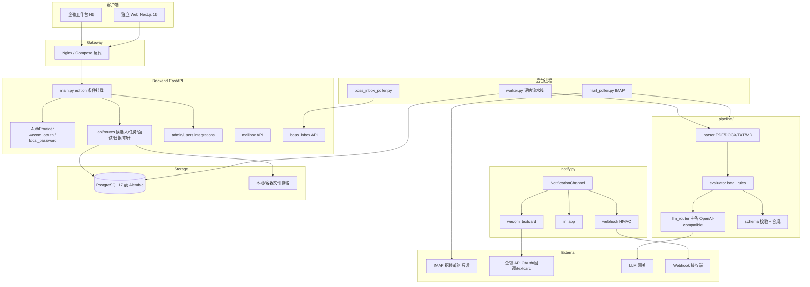
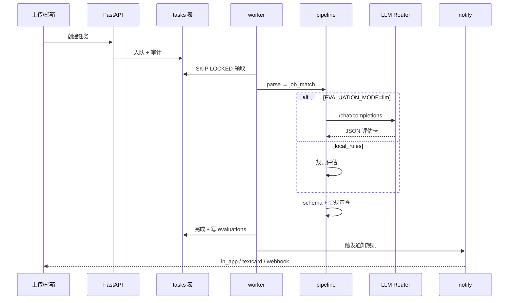

# 曜承 HR Agent 技术架构

- **版本**：一期 v1.0
- **日期**：2026-07-06
- **对应 Spec**：[`../product/spec.md`](../product/spec.md)
- **项目索引**：[`../README.md`](../README.md)
- **代码仓库**：`/Users/yaocheng/Desktop/nexus/Ai/hr—agent/hr-agent-app`

---

## 1. 架构总览



---

## 2. 双版本架构（共享内核 + 双适配层）

部署开关：`DEPLOY_EDITION=wecom|standalone`

```mermaid
flowchart TD
    DEP[DEPLOY_EDITION]
    subgraph WEcomAdapter["企微适配层"]
        WA1[wecom/oauth + callback 加解密]
        WA2[wecom_textcard]
        WA3[企微 H5 容器 + 深链]
    end
    subgraph StandaloneAdapter["独立 Web 适配层"]
        SA1[local_password argon2id]
        SA2[in_app + webhook]
        SA3[/login /integrations /admin/users]
    end
    subgraph CORE["共享内核 ~80%"]
        C1[AuthProvider 接口 JWT 12h]
        C2[NotificationChannel 接口]
        C3[mailbox-ingest 全链]
        C4[pipeline + worker 评估链]
        C5[candidate-domain 四套状态机]
        C6[report + audit + RBAC]
        C7[PostgreSQL + LLM Router]
    end
    DEP --> WEcomAdapter
    DEP --> StandaloneAdapter
    WA1 --> C1
    SA1 --> C1
    C2 --> WA2
    C2 --> SA2
    C3 --> C4 --> C5 --> C2
    C6 --> C7
```

**架构约束：**

- standalone 下不挂载 `/wecom/oauth/*`、`/api/wecom/callback`
- 共享内核（pipeline / worker）**禁止** import wecom 模块
- `source` 枚举已中性化：`manual_upload` 替代 `wecom_upload`

---

## 3. 技术选型

| 组件 | 选型 | 说明 |
|------|------|------|
| **Backend** | FastAPI + SQLAlchemy 2 + Alembic | Python 3.12（CI 口径） |
| **Frontend** | Next.js 16 App Router + React 19 | 同域反代 /api |
| **数据库** | PostgreSQL 15+ | 17 表，Alembic 管理 |
| **任务队列** | DB SKIP LOCKED + worker 进程 | 非 Redis/Celery |
| **邮箱** | IMAP 只读（mail_poller） | 零 SMTP |
| **LLM** | OpenAI-compatible Router | 主 gpt-5.4 / 备 gpt-5.4-mini；`EVALUATION_MODE=local_rules\|llm` |
| **认证** | JWT HttpOnly Cookie 12h | AuthProvider 抽象 |
| **密码** | argon2id | standalone 本地登录 |
| **企微** | 自建应用 OAuth + WXBizMsgCrypt | wecom/ 子包 |
| **部署** | Docker Compose | 6 常驻 + migrate 一次性 |
| **CI** | GitHub Actions | backend pytest + frontend build + edition matrix |

### 3.1 Compose 服务

| 服务 | 职责 |
|------|------|
| postgres | 主库 |
| migrate | alembic upgrade head（一次性） |
| api | FastAPI uvicorn |
| web | Next.js standalone |
| worker | 评估任务 + 日报入队 |
| mail-poller | IMAP 轮询（默认 2min） |
| boss-inbox-poller | BOSS 会话同步 |

### 3.2 明确不选（一期）

| 不选 | 原因 |
|------|------|
| Celery / Redis 队列 | MVP 用 DB 锁足够 |
| SMTP 发信 | 一期安全纪律 |
| 微服务拆分 | 单仓单体 |
| BOSS 爬虫 SDK | 合规红线 |

---

## 4. 数据模型概要（17 表）

| 域 | 核心表 |
|----|--------|
| 租户/用户 | tenants, users, roles |
| 岗位 | jobs, job_templates |
| 候选人 | candidates, candidate_contacts, evaluations |
| 任务 | tasks, task_files |
| 邮箱 | mailbox_accounts, inbound_emails |
| BOSS | boss_accounts, boss_conversations, boss_action_logs |
| 协同 | interviews, interview_feedbacks, reviews |
| 通知 | notifications（channel 泛化） |
| 系统 | audit_logs, tenant_kv |

---

## 5. 评估流水线



**PDF 无文本层：** 页面渲染为图片 → 多模态 LLM 提取正文 → 进入评估。

---

## 6. org_mode 分流（simple / standard）

| 层 | 行为 |
|----|------|
| 认证/配置 | `/api/config` 暴露 org_mode |
| 前端 | nav.ts / labels.ts 按模式收敛导航与文案 |
| 权限 | simple 限制角色选项；boss 权限并集 |
| **共享 pipeline** | **不依赖 org_mode** |

---

## 7. 安全架构

| 机制 | 实现 |
|------|------|
| 凭据存储 | credential_ref 加密；`.env` / `roles.yaml` 不进 git |
| 审计脱敏 | detail JSON 不含 PII 原文 |
| Prompt 注入 | 简历/邮件注入样本回归 |
| Webhook SSRF | 内网/链路本地地址拒绝 |
| Cookie | 生产 Secure 标志 |
| 删除 | 软删除 + 文件不可访问 + 级联审计 |
| BOSS 红线 | 禁止 greet/search/batch-view；生产禁 mock 绑定 |

---

## 8. 部署拓扑

### 8.1 Standalone（推荐开发/预试点）

```bash
cp .env.standalone.example .env
docker compose up -d --build
# web:3000 / api:8000 / postgres:15432
```

### 8.2 WeCom（叠加 override）

```bash
cp .env.wecom.example .env
docker compose -f docker-compose.yml -f compose.wecom.yaml up -d --build
```

### 8.3 Simple 模式 seed

```env
DEPLOY_EDITION=standalone
SEED_ORG_MODE=simple
SEED_BOSS_EMAIL=...
SEED_BOSS_INITIAL_PASSWORD=...
```

---

## 9. 测试与回归

| 类型 | 入口 |
|------|------|
| 单元/集成 | `backend pytest -q`（202 tests） |
| 回归样本 | `tests/test_regression_samples.py` + manifest 20 简历 + 15 邮件 |
| 安全红线 | `tests/test_security_redlines.py` |
| Edition smoke | standalone/wecom OpenAPI 路由检查 |
| Simple matrix | `scripts/simple_mode_smoke_matrix.py` 四组合 |
| BOSS smoke | `scripts/smoke_boss_inbox.py` |
| Pilot evidence | `scripts/pilot_sample_evidence.py`（offline gate） |

---

## 10. 目录结构（代码仓库）

```
hr-agent-app/
├── backend/app/
│   ├── main.py              # edition 条件挂载
│   ├── api/routes.py        # REST API
│   ├── wecom/               # 企微适配（插件）
│   ├── pipeline/            # 解析/评估/LLM/schema
│   ├── mailbox.py           # Mail Classifier
│   ├── mail_poller.py       # IMAP 轮询
│   ├── boss_inbox/          # BOSS 助手
│   ├── notify.py            # NotificationChannel
│   ├── worker.py            # 任务 worker
│   └── models.py            # 17 表
├── frontend/app/            # Next.js 页面
├── config/*.example.yaml    # 角色/岗位/BOSS 规则种子
├── docker-compose.yml
└── docs/                    # 部署与验收手册
```

---

## 11. 与 v0.4 路线图关系

| Phase | 一期覆盖 | 后续 |
|-------|----------|------|
| Phase 1 企微 MVP | ✅ 双版本扩展完成 | — |
| Phase 1 邮箱入站 | ✅ | — |
| Phase 2 出站邮件 | — | Phase 2 plan |
| Phase 4 RAG | — | Phase 2 plan |
| Phase 7 SaaS | 预埋 AuthProvider/NotificationChannel | Phase 2–3 |

---

## 12. 变更日志

| 版本 | 日期 | 变更 |
|------|------|------|
| v0.1 | 2026-07-06 | 从双版本总体方案 + 完结报告建档 |
