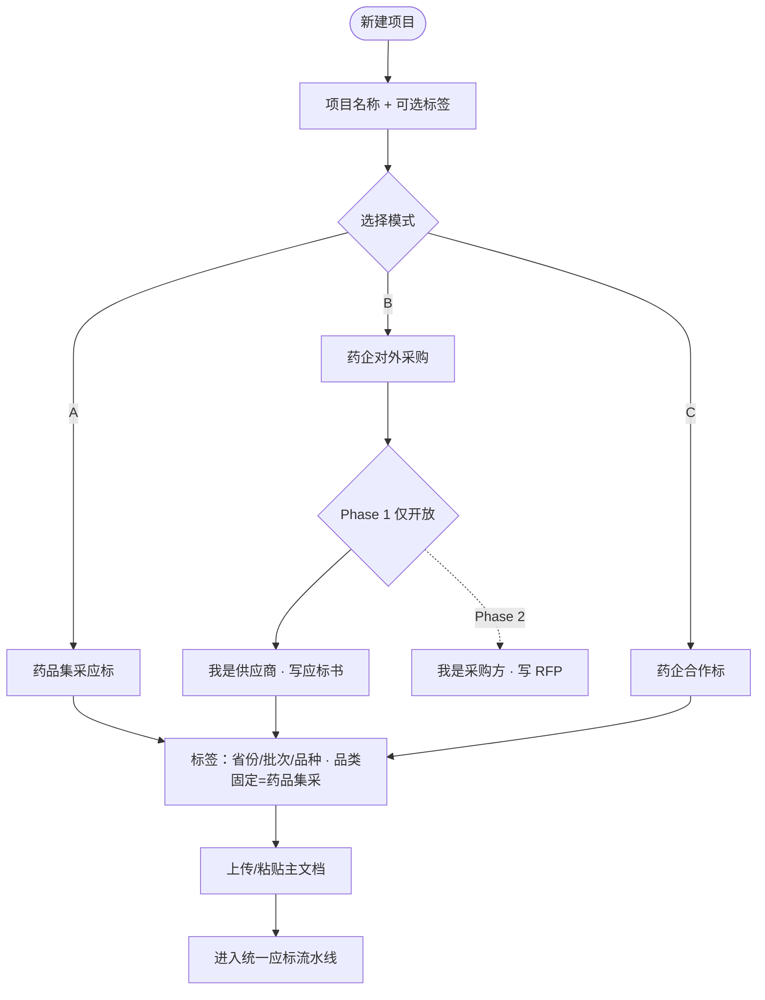
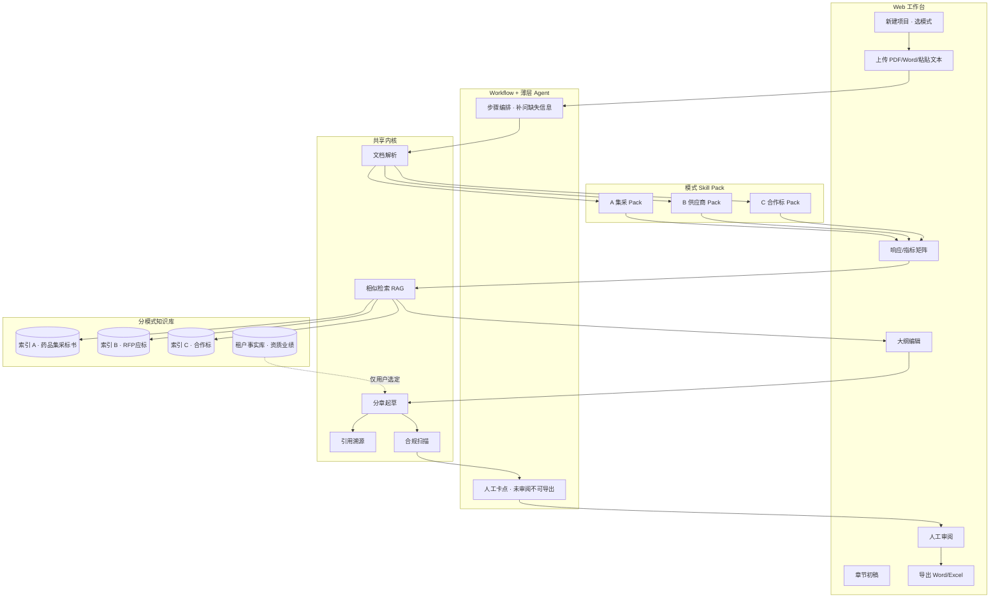
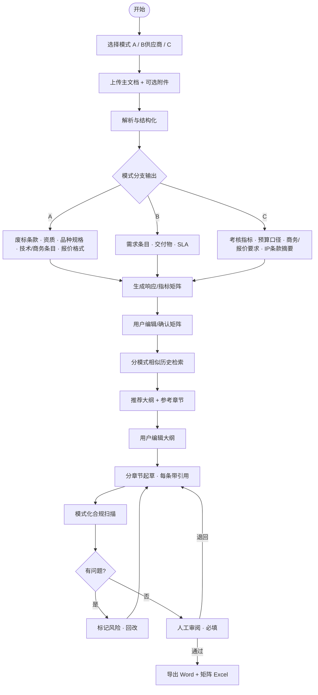
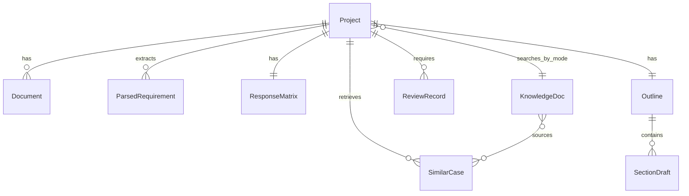

# BidPilot — 医药行业多模式招标智能工作台

- **版本**：v0.2
- **日期**：2026-07-06
- **状态**：部分可开发
- **等级**：L3
- **交付形态**：Web SaaS
- **关键词**：招标、标书、集采应标、药企合作标、Workflow、Skill Pack、RAG

---

## 1. 背景与目标

### 用户原意

高校希望合作开发面向药企等场景的招标专项能力。已有数据：**历年招标要求 + 对应标书**。需支持「药企招标」全谱系场景，用户自行选择模式，而非单一垂直工具。

### 要解决的问题

| 痛点 | 现状 | 产品应对 |
|------|------|----------|
| 读招标/合作文件耗时长 | 数十页 PDF，废标条款分散 | **模式化解析** + 结构化清单 |
| 响应表手工对照 | Excel 点对点易漏项 | **响应/指标矩阵** 自动生成 |
| 同类项目无参考 | 依赖个人经验 | **分模式历史标书检索** + 大纲推荐 |
| 写作从零开始 | 重复造轮子 | **分章节初稿**（带引用，人审后导出） |
| 通用 AI 不可信 | 编造资质、漏废标 | **合规扫描** + 禁止自动填事实 + 强制审阅 |

### 成功指标（Phase 1 验证期，4–8 周 × 5–10 试点项目）

| 指标 | 目标 |
|------|------|
| 招标文件结构化耗时 | 较人工缩短 ≥ 60% |
| 响应矩阵首次完整度 | ≥ 80% 条目被正确识别（人工抽检） |
| 用户愿继续用于下一项目 | ≥ 70% 试点项目 |
| 合规事故 | 0（无 AI 自动写入未核实资质/业绩） |

### 非目标（Out of Scope — Phase 1）

- 一键生成可直接提交的完整标书（无人工审阅）
- AI 自动填写企业资质、业绩、人员证书等 **事实性字段**
- **B 模式采购方发标**（RFP 撰写、评分表、供应商比选）— Phase 2
- 跨模式（A/B/C）混合检索（默认关闭）
- 在线投标递交、电子签章、CA 锁集成
- 与 RepPilot 深度集成（Phase 1 独立交付）
- **Cursor/Office 插件、H5、小程序**（Phase 1 不做；见 Web SaaS 架构）

---

## 2. 三种模式定义

用户 **新建项目时必选一种模式**；项目创建后 **不建议切换模式**（schema 不同，需新建项目）。

### 2.1 模式 A — 药品集采应标（Phase 1 首发品类）

| 项 | 说明 |
|----|------|
| **场景** | **药品**在国采、省采及关联集中带量采购中的 **应标** |
| **Phase 1 范围** | 仅药品集采；**不做**器械、服务、院内非集采采购 |
| **用户** | 药企招投标部、市场准入、标书服务商 |
| **输入** | 集采公告、招标文件、品种目录、技术/商务要求、报价说明 |
| **输出** | 废标/资质清单、**技术标 + 商务标** 响应矩阵、推荐大纲、章节初稿（Phase 2+） |
| **合规重心** | 废标条款、格式、签章、偏离表、**报价表结构合规**（金额由人工填写） |

### 2.2 模式 B — 药企对外采购（Phase 1：供应商应标）

| 项 | 说明 |
|----|------|
| **场景** | 药企发布 RFP/询比价，**供应商**撰写应标方案 |
| **用户** | CRO、物流、IT、营销等 **供应商** 投标团队 |
| **与 A 关系** | **共用应标引擎**（解析 → 矩阵 → 检索 → 大纲 → 起草） |
| **差异** | 文档称谓（RFP/需求规格）、模板库索引 `mode=B`、合规规则偏「必选交付物/服务 SLA」 |
| **Phase 2** | 采购方发标：需求梳理 → RFP 生成 → 评分 rubric |

### 2.3 模式 C — 药企合作标（首发文档类型）

| 项 | 说明 |
|----|------|
| **场景** | 药企发布的 **研发合作、产学研联合项目、技术转移、联合实验室** 等征集/招标 |
| **用户** | 高校科研处、产学研办、研究所、CRO；亦可能是药企 BD 团队整理对外材料 |
| **输入** | 合作指南、征集通知、项目任务书、评分/考核说明、**商务与报价要求** |
| **输出** | 考核指标映射表、合作方案大纲（**含商务/报价章**）、分章节初稿 |
| **合规重心** | 指标可考核、预算合规、**报价口径与指南一致**、IP 归属表述（提示性，非法律意见） |

### 2.4 模式选择 UX

---

## 3. 产品逻辑图

---

## 4. 统一主流程（A / B 供应商 / C 共用骨架）

---

## 5. Phase 1 功能模块

### 5.1 项目与模式管理 — P0

- 新建项目：模式 A / B（供应商）/ C
- 项目元数据：名称、省份/批次/品种（A）、省份/年份（B/C）
- **A 模式**：品类固定为 `药品集采`，UI 不展示器械/服务选项（Phase 2 扩展）
- 项目列表按模式筛选

### 5.2 文档解析 — P0

**输入**：PDF、Word、粘贴纯文本（单文件 MVP；多附件 Phase 2）

**输出（因模式而异）**：

| 字段类型 | A 药品集采 | B 供应商 | C 合作标 |
|----------|------------|----------|----------|
| 时间节点 | 投标截止、开标、解密 | 同左 | 申报截止 |
| 品种/规格 | **通用名、剂型、规格、包装** | — | — |
| 资格/门槛 | GMP、委托生产、产能承诺 | 供应商资质 | 团队、前期基础 |
| 核心要求条目 | 技术参数、质量层次、*条款 | 服务范围、交付物 | 考核指标、里程碑 |
| 商务/报价 | **报价表结构、降幅规则、限价** | 报价/费率要求 | **合作预算、里程碑付款、报价口径** |
| 风险项 | **废标条款** | 必选响应项 | 预算上限、IP 归属 |
| 评分/权重 | 技术/商务/价格分 | 评估维度 | 技术/商务/价格权重 |

### 5.3 响应/指标矩阵 — P0

- 自动：招标/指南条目 → 矩阵行
- 列（A 药品集采）：条款编号、要求摘要、**标书类型（技术/商务）**、响应状态、对应章节、备注
- 列（B）：条款编号、要求摘要、响应状态、对应标书章节、备注
- 列（C）：指标编号、考核描述、**章节类型（技术/商务/报价）**、方案章节映射、可交付成果
- **商务/报价行**：AI 仅生成结构与填写说明，**金额/费率/降幅等数值字段占位 `{{待填写}}`**
- 支持 Excel 导出、手工增删改

### 5.4 历史相似检索 — P0

- **硬过滤**：仅检索当前 `mode` 索引
- 输入：当前项目解析摘要 + 用户标签
- 输出：Top-K 相似历史项目（标题、年份、相似度、可跳转参考段落）
- 高校提供的脱敏标书库作为 **行业层**；租户上传历史作为 **租户层**

### 5.5 大纲推荐 — P0

- 基于：模式模板 + 相似历史 + 当前矩阵
- 用户可增删章节、调整顺序
- C 合作标默认结构（**含商务/报价**）：
  - **技术部分**：项目理解 → 团队与基础 → 技术路线 → 实施计划 → 考核指标响应
  - **商务部分**：合作模式与分工 → 预算与里程碑付款 → **报价表/费用明细** → 风险与 IP
- A 药品集采默认结构：**技术标**（资质、质量、供应保障等）+ **商务标**（报价表、承诺函等）分册大纲

### 5.6 分章节初稿 — P1（C 优先；A/B 可 Phase 1 末或 Phase 2 初）

- 按大纲逐章生成
- **每条论述附引用**：`[来源：历史项目 X / 用户附件 Y / 指南 §Z]`
- **禁止**：自动写入资质编号、**报价金额/降幅/费率**、合同金额、人员姓名等事实字段（占位符 `{{待填写}}`）

### 5.7 合规扫描 — P1

| 模式 | 扫描项 |
|------|--------|
| A 药品集采 | 疑似废标风险、未响应条目、格式项遗漏、**报价表缺项/结构不符** |
| B | 必选交付物未覆盖 |
| C | 指标无对应方案、预算口径提示、**商务/报价章缺项、付款里程碑未覆盖** |

### 5.8 人工审阅与导出 — P0

- 未标记「审阅通过」→ **禁止**导出正式稿
- 导出：Word（大纲+正文）、矩阵 Excel
- 水印/页眉：`AI 辅助草稿 · 提交前务必人工核实`

---

## 6. 模式差异：Skill Pack 一览

| Skill | A 药品集采 | B 供应商 | C 合作标 |
|-------|------------|----------|----------|
| 解析 | 废标/偏离/品种规格/报价格式 | RFP 需求条目 | 指标/IP/预算/**商务报价要求** |
| 矩阵 | 技术+商务响应表 | 交付物响应表 | 指标映射 + **商务/报价映射** |
| 模板 | 技术标 + 商务标分册 | 服务方案结构 | 合作方案 + **商务/报价章** |
| 合规 | 废标 + 报价表结构扫描 | 必选项扫描 | 指标闭环 + **报价口径扫描** |
| 索引库 | 药品集采标书 | RFP 应标 | 药企合作标（含商务样本） |

---

## 7. 数据模型（逻辑层）

| 对象 | 关键字段 | 说明 |
|------|----------|------|
| **Project** | id, mode(A/B/C), category(drug_procurement/null), b_role(supplier/null), title, tags[], status | 招标项目；A 固定 `category=drug_procurement` |
| **Document** | id, project_id, file_url, doc_type, parsed_json | 上传文件 |
| **ParsedRequirement** | id, project_id, clause_no, summary, category, risk_level | 解析条目 |
| **ResponseMatrix** | id, project_id, rows[], version | 响应/指标矩阵 |
| **SimilarCase** | id, project_id, source_id, score, snippet | 检索命中 |
| **Outline** | id, project_id, sections[], version | 大纲 |
| **SectionDraft** | id, outline_id, content, citations[], status | 章节草稿 |
| **ReviewRecord** | id, project_id, reviewer, approved_at, notes | 审阅记录 |
| **KnowledgeDoc** | id, mode, tags[], tenant_id(null=行业库), chunks[] | 知识库 |
| **TenantFact** | id, tenant_id, fact_type, value, verified_at | 用户核实的事实库 |

### 实体关系

---

## 8. 界面要点（Phase 1 Web SaaS）

**交付形态**：桌面浏览器 Web 应用（`app.bidpilot.com`）；≥1280px 为设计基准；不做独立 H5/插件。

| 页面 | 核心元素 |
|------|----------|
| **项目列表** | 模式筛选、状态、最后更新 |
| **新建项目** | 模式卡片 A/B/C；B 仅显示「供应商应标」 |
| **文档上传** | 拖拽 PDF/Word、解析进度 |
| **解析结果** | 分 Tab：时间节点 / 品种规格 / 资格 / 要求 / 商务报价 / 风险 |
| **响应矩阵** | 可编辑表格、导出 Excel |
| **相似案例** | 卡片列表、查看参考段落 |
| **大纲** | 树形编辑、从模板/案例插入 |
| **章节编辑** | 左侧目录 / 右侧正文+引用侧栏 |
| **审阅** | 通过/退回、审阅意见 |
| **导出** | Word + Excel |

---

## 9. 边界情况

| 情况 | 期望行为 |
|------|----------|
| 扫描版 PDF 无法解析 | OCR 降级；提示用户粘贴关键章节 |
| 解析遗漏条目 | 用户矩阵手工补行；反馈用于改进 |
| 检索无相似案例 | 仅用模式默认模板生成大纲 |
| 用户跳过审阅点导出 | **拦截**，仅允许导出「草稿预览」带水印 |
| C 合作标涉及 IP 法律条款 | 仅摘要+提示「需法务确认」，不给法律结论 |
| 商务/报价数值字段 | AI 只出表头与填写说明；金额/降幅/费率必须人工填写 |
| B 用户误选采购方 | Phase 1 UI 不展示该选项；若强需求则引导 Phase 2 |

---

## 10. 安全与边界

### 权限

- 用户仅可访问本人/本租户 Project 与上传文件
- 行业库（高校）只读；租户库隔离
- Admin：知识库入库审核（高校协作场景）

### 数据

| 数据类型 | 存储 | 可见性 |
|----------|------|--------|
| 上传招标文件 | 对象存储 + 元数据 DB | 租户内 |
| 解析/矩阵/草稿 | PostgreSQL | 租户内 |
| 行业历史标书 | 向量库 + 对象存储 | 只读检索；脱敏 |
| 审阅记录 | PostgreSQL | 审计 ≥ 2 年 |

### 禁止项

- AI 自动写入未核实的资质、业绩、**报价金额/降幅/费率**、人员
- 跨租户检索其他企业标书内容
- 默认跨模式混检（A 项目检索 C 库）
- 声称「保证中标」类输出
- 输出 definitive 法律/财务意见

### 待用户确认项

- [ ] 产品正式名称
- [x] ~~A 模式 Phase 1 首发品类~~ → **药品集采**
- [ ] 高校数据商用与脱敏协议
- [ ] 目标代码仓库
- [x] ~~C 合作标是否含商务/报价章节~~ → **含商务/报价章**
- [x] ~~Phase 1 交付形态~~ → **Web SaaS**

---

## 11. 分期路线图

| 阶段 | 周期 | A | B 供应商 | C 合作标 | B 采购发标 |
|------|------|---|----------|----------|------------|
| **Phase 1** | 6–8 周 | 药品集采：解析+矩阵+检索+大纲 | 共用 A | 解析+矩阵+大纲+章节初稿（含商务/报价） | — |
| **Phase 2** | 6 周 | 分章+废标扫描 | 加深 | 指标合规+案例库 | RFP+评分表 |
| **Phase 3** | — | 评分对齐 | — | — | 供应商比选 |

---

## 12. 关联

- 项目索引：[`../README.md`](../README.md)
- 技术架构：[`../tech/architecture.md`](../tech/architecture.md)
- 开发规划：[`../plans/plan.md`](../plans/plan.md)
- 讨论记录：[`../ideas/2026-07-06-pharma-bid-agent.md`](../ideas/2026-07-06-pharma-bid-agent.md)
- 开放问题：[`../questions/open-questions.md`](../questions/open-questions.md)
- 姊妹产品：[`../pharma-rep-agent/README.md`](../pharma-rep-agent/README.md)（RepPilot）
