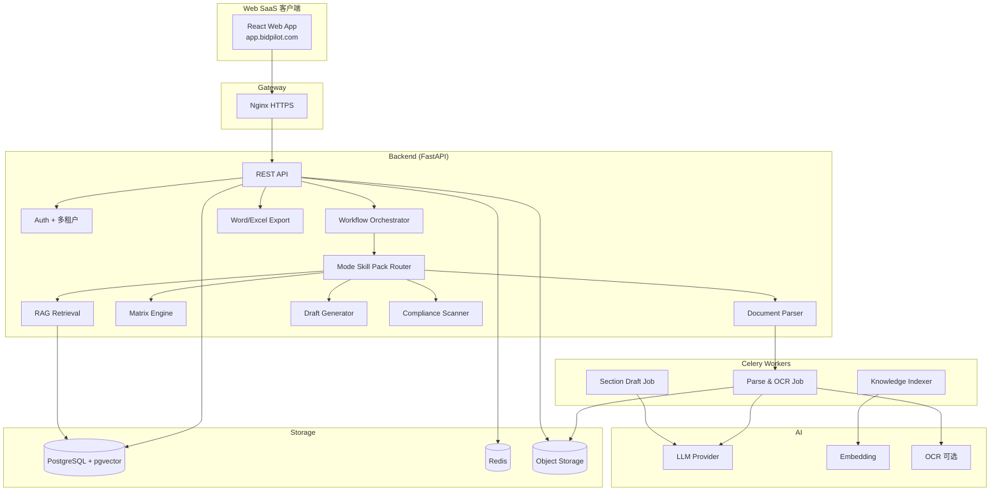
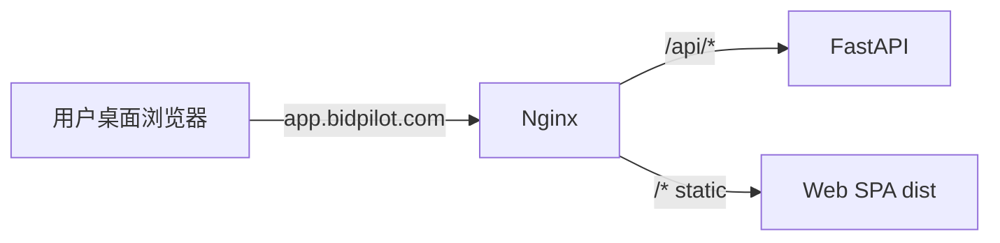
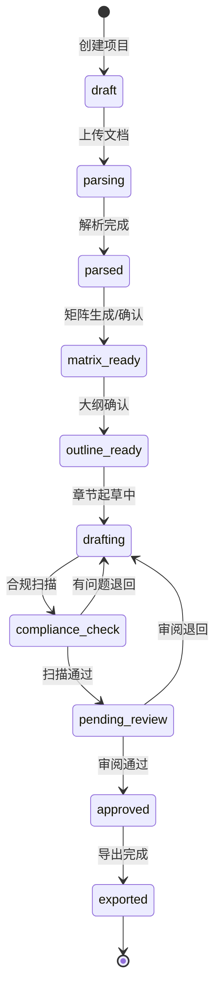
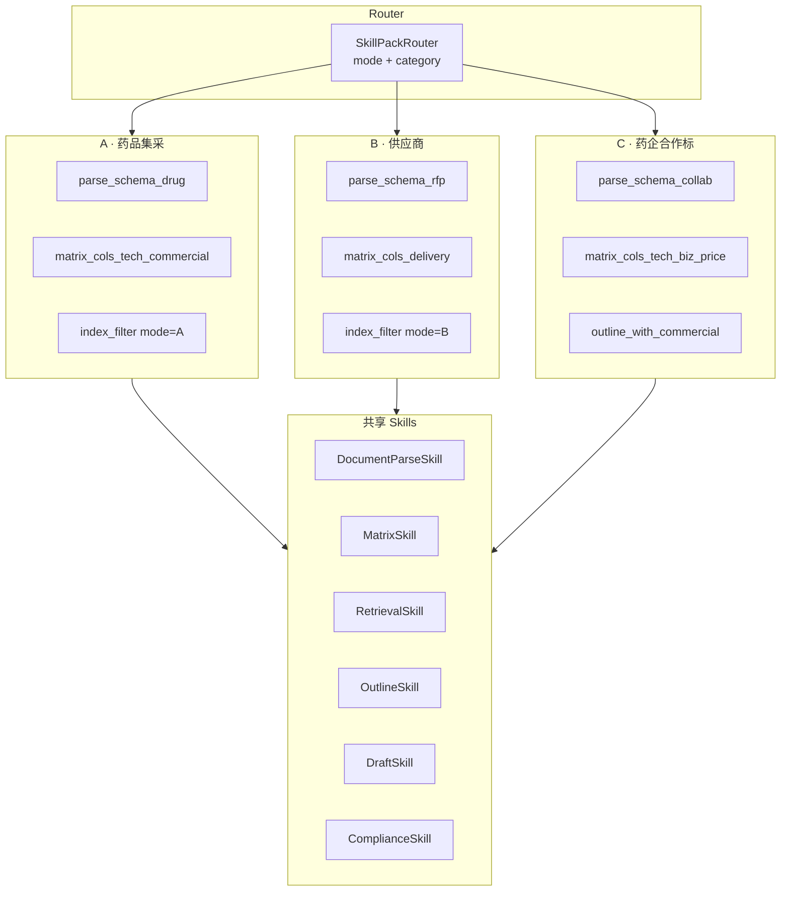
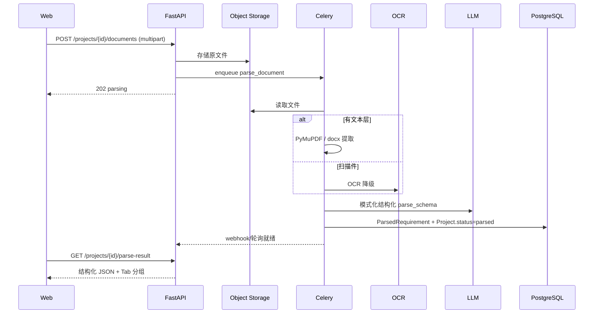
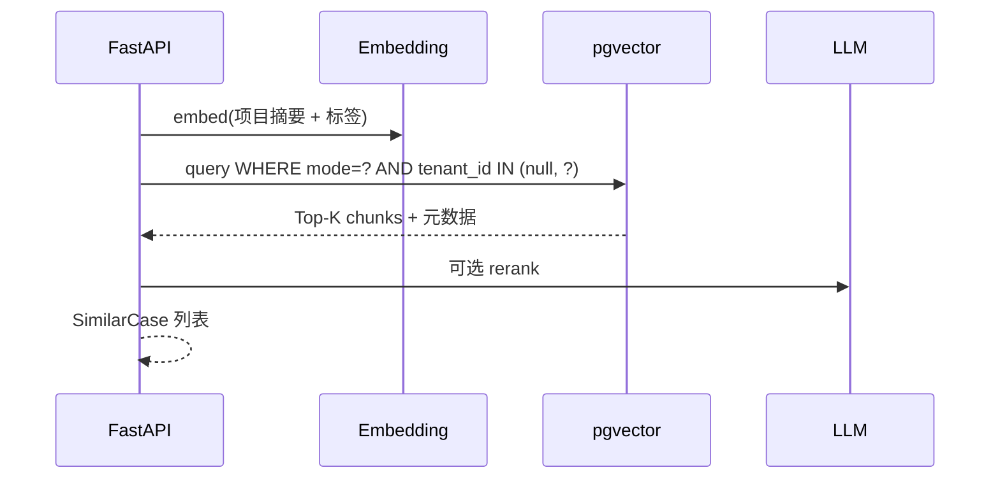
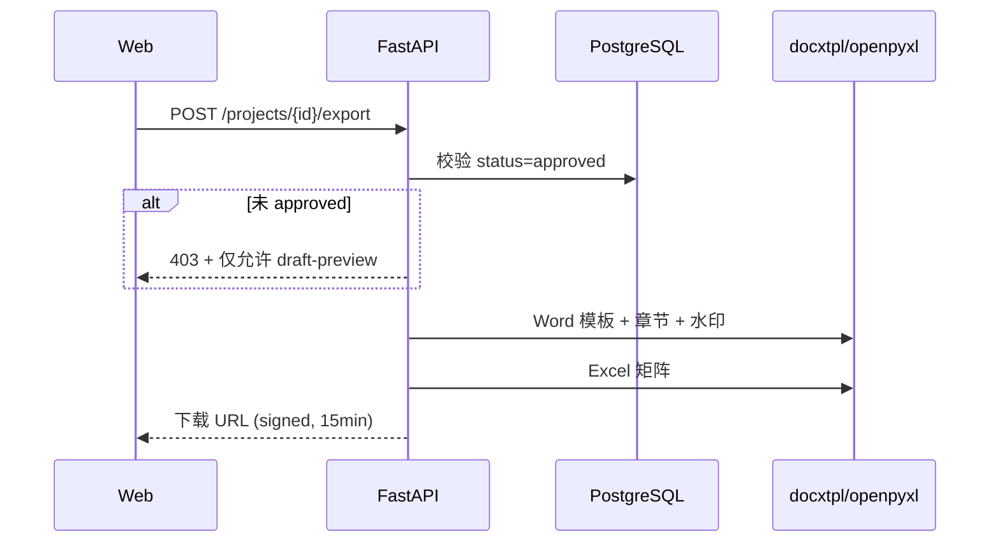

# BidPilot 技术架构

- **版本**：v0.1
- **日期**：2026-07-06
- **对应 Spec**：[`../product/spec.md`](../product/spec.md)
- **项目索引**：[`../README.md`](../README.md)
- **交付形态**：**Phase 1 Web SaaS**（桌面浏览器为主；不做插件、不做 H5/小程序）

---

## 1. 架构总览



---

## 2. 技术选型

### 2.1 选型原则

- **Web SaaS 单端**：Phase 1 仅桌面 Web；标书编辑以宽屏、表格、双栏为主
- **Workflow 优先**：后端显式状态机，非纯 Chat 会话
- **模式插件化**：A/B/C Skill Pack 共享内核，独立 prompt/schema/索引过滤
- **MVP 单体**：FastAPI 单体 + Celery；不做微服务

### 2.2 选型表

| 组件 | 选型 | 理由 | 备选 |
|------|------|------|------|
| **Web 前端** | React 18 + Vite + Tailwind + shadcn/ui | 复杂表格/树形大纲/双栏编辑 | Ant Design Pro |
| **表格编辑** | TanStack Table + 自研可编辑单元格 | 响应矩阵高频编辑 | AG Grid |
| **富文本/章节** | TipTap 或 Lexical | 章节草稿编辑 | — |
| **API 框架** | FastAPI 0.110+ | 异步、OpenAPI | — |
| **ORM** | SQLAlchemy 2 + Alembic | migration 成熟 | — |
| **主数据库** | PostgreSQL 15 + pgvector | 业务 + 向量一体 | — |
| **缓存/队列** | Redis 7 + Celery | 解析/索引异步 | — |
| **LLM** | 通义 qwen-max / DeepSeek | 中文长文档 | GPT-4o |
| **Embedding** | bge-m3 | 中文标书 | text-embedding-3-small |
| **RAG** | LlamaIndex 或 LangChain minimal | 分 mode 过滤 | 自研 |
| **PDF 解析** | PyMuPDF + pdfplumber | 文本层优先 | — |
| **Word 解析** | python-docx | .docx 原生 | LibreOffice headless |
| **OCR** | PaddleOCR / 阿里云 OCR | 扫描件降级 | — |
| **Word 导出** | python-docx + docxtpl | 模板套红 | — |
| **Excel 导出** | openpyxl | 矩阵导出 | — |
| **对象存储** | 阿里云 OSS / MinIO | 上传文件 | — |
| **认证** | JWT + 邮箱/手机号 | SaaS 标准 | Magic Link |
| **多租户** | tenant_id 行级隔离 | MVP 够用 | 独立 schema |
| **反向代理** | Nginx | HTTPS、静态资源 | Caddy |
| **Admin** | Web `/admin` 路由 | 知识库入库审核 | — |

### 2.3 明确不选（Phase 1）

| 不选 | 原因 |
|------|------|
| Cursor/Office 插件 | 用户确认 Phase 1 走 Web SaaS |
| H5 / 微信小程序 | 标书场景桌面为主 |
| 微服务 / K8s 复杂编排 | MVP 单体足够 |
| 在线电子投标 / CA 锁 | Spec Out of Scope |

---

## 3. Web SaaS 部署与路由



| 入口 | 说明 |
|------|------|
| `app.bidpilot.com` | Web SPA（项目、矩阵、大纲、章节、审阅、导出） |
| `app.bidpilot.com/api` | FastAPI REST |
| `app.bidpilot.com/admin` | 知识库审核（Admin 角色） |

**响应式**：窄屏可读，但不单独做 H5 产品；MVP 以 ≥1280px 为设计基准。

---

## 4. Workflow 状态机



**规则**：
- `approved` 之前：**禁止**导出无水印正式稿
- 状态变更写 `ProjectStatusLog` 审计

---

## 5. Mode Skill Pack 架构



**实现**：Python 抽象基类 `BaseSkillPack`，子类 `DrugProcurementPack` / `SupplierBidPack` / `CollabBidPack`；注册表按 `Project.mode` + `Project.category` 解析。

---

## 6. 文档解析流水线



---

## 7. RAG 检索（分模式硬过滤）



**索引字段**：`mode`, `category`, `province`, `batch`, `product_name`, `doc_type`, `tenant_id`

**行业库**：`tenant_id IS NULL`（高校脱敏数据，Admin 审核入库）  
**租户库**：用户历史上传（仅本租户可见）

---

## 8. 导出流水线



**商务/报价数值**：导出前扫描 `{{待填写}}` 占位；若有未填项 → 警告但不阻断（用户责任）

---

## 9. Monorepo 目录结构

```
bid-pilot/
├── backend/
│   ├── app/
│   │   ├── api/
│   │   │   ├── auth.py
│   │   │   ├── tenants.py
│   │   │   ├── projects.py
│   │   │   ├── documents.py
│   │   │   ├── parse.py
│   │   │   ├── matrix.py
│   │   │   ├── retrieval.py
│   │   │   ├── outline.py
│   │   │   ├── drafts.py
│   │   │   ├── review.py
│   │   │   ├── export.py
│   │   │   └── admin/
│   │   │       └── knowledge.py
│   │   ├── workflow/
│   │   │   ├── state_machine.py
│   │   │   └── orchestrator.py
│   │   ├── skill_packs/
│   │   │   ├── base.py
│   │   │   ├── drug_procurement.py   # A
│   │   │   ├── supplier_bid.py       # B
│   │   │   └── collab_bid.py         # C
│   │   ├── services/
│   │   │   ├── parser.py
│   │   │   ├── ocr.py
│   │   │   ├── retrieval.py
│   │   │   ├── compliance.py
│   │   │   └── export.py
│   │   ├── models/
│   │   ├── schemas/
│   │   ├── tasks/
│   │   └── main.py
│   ├── migrations/
│   ├── templates/
│   │   ├── export/                     # Word/Excel 模板
│   │   └── skill_packs/                # prompt 模板
│   └── pyproject.toml
├── frontend/
│   ├── src/
│   │   ├── pages/
│   │   │   ├── projects/
│   │   │   ├── parse/
│   │   │   ├── matrix/
│   │   │   ├── outline/
│   │   │   ├── editor/
│   │   │   ├── review/
│   │   │   └── admin/
│   │   ├── components/
│   │   │   ├── EditableMatrix/
│   │   │   ├── OutlineTree/
│   │   │   └── CitationSidebar/
│   │   └── lib/api.ts
│   └── vite.config.ts
├── docker-compose.yml
├── nginx.conf
└── README.md
```

---

## 10. API 设计（Phase 1 MVP）

| Method | Path | 说明 |
|--------|------|------|
| POST | `/auth/register` | 注册（邮箱/手机） |
| POST | `/auth/login` | 登录 |
| GET/POST | `/projects` | 项目列表 / 创建（含 mode） |
| GET/PATCH | `/projects/{id}` | 详情 / 更新元数据 |
| POST | `/projects/{id}/documents` | 上传招标文件 |
| GET | `/projects/{id}/parse-result` | 解析结果（分 Tab） |
| GET/PATCH | `/projects/{id}/matrix` | 响应矩阵 |
| POST | `/projects/{id}/matrix/regenerate` | 重新生成矩阵 |
| GET | `/projects/{id}/similar-cases` | 相似历史检索 |
| GET/PATCH | `/projects/{id}/outline` | 大纲 |
| POST | `/projects/{id}/outline/recommend` | 推荐大纲 |
| GET/PATCH | `/projects/{id}/drafts/{section_id}` | 章节草稿 |
| POST | `/projects/{id}/drafts/generate` | 批量/单章生成 |
| POST | `/projects/{id}/compliance/scan` | 合规扫描 |
| POST | `/projects/{id}/review` | 提交审阅 / 通过 / 退回 |
| POST | `/projects/{id}/export` | 导出 Word+Excel（需 approved） |
| GET | `/projects/{id}/export/preview` | 草稿预览（带水印） |
| GET/POST | `/admin/knowledge` | 行业库入库（Admin） |

---

## 11. 环境变量

```bash
# .env.example
DATABASE_URL=postgresql+asyncpg://...
REDIS_URL=redis://...
JWT_SECRET=
JWT_EXPIRE_MINUTES=10080

LLM_API_KEY=
LLM_BASE_URL=
LLM_MODEL=qwen-max
EMBEDDING_MODEL=bge-m3

OSS_ENDPOINT=
OSS_BUCKET=
OSS_ACCESS_KEY=
OSS_SECRET_KEY=

OCR_PROVIDER=paddle  # or aliyun
OCR_ENABLED=true

APP_BASE_URL=https://app.bidpilot.com
CORS_ORIGINS=https://app.bidpilot.com

SENTRY_DSN=
ADMIN_EMAILS=ops@example.com
```

---

## 12. 安全架构

- 全站 HTTPS
- JWT 短过期 + refresh；`tenant_id` 贯穿所有查询
- 对象存储 signed URL；上传 MIME 白名单（pdf, docx）
- 行业库只读；跨租户检索 **禁止**
- RAG 检索 SQL 强制 `mode = project.mode`
- 导出审计：`ExportLog(user, project, ip, at)`
- LLM 输出：**报价/资质数值** 后处理替换为 `{{待填写}}`（ComplianceFilter）
- Admin 路由：角色 + 可选 IP 白名单

---

## 13. 非功能需求（Phase 1）

| 维度 | MVP 目标 |
|------|----------|
| 文档解析（50 页 PDF） | P95 < 3min（异步） |
| 矩阵生成 | P95 < 30s |
| 相似检索 | P95 < 2s |
| 单章起草 | P95 < 20s |
| 并发 | 20 租户 × 5 活跃项目 |
| Web 首屏 | LCP < 2s（宽带） |

---

## 14. 预估月成本（试点期）

| 项 | 估算 |
|----|------|
| 云服务器 4C8G | ≈ 200–400 元 |
| PostgreSQL | ≈ 150–300 元 |
| OSS | ≈ 30–80 元 |
| LLM（10 项目/月 × 解析+起草） | ≈ 300–800 元 |
| OCR（按需） | ≈ 50–200 元 |

---

## 15. 关联

- Spec：[`../product/spec.md`](../product/spec.md)
- Plan：[`../plans/plan.md`](../plans/plan.md)
