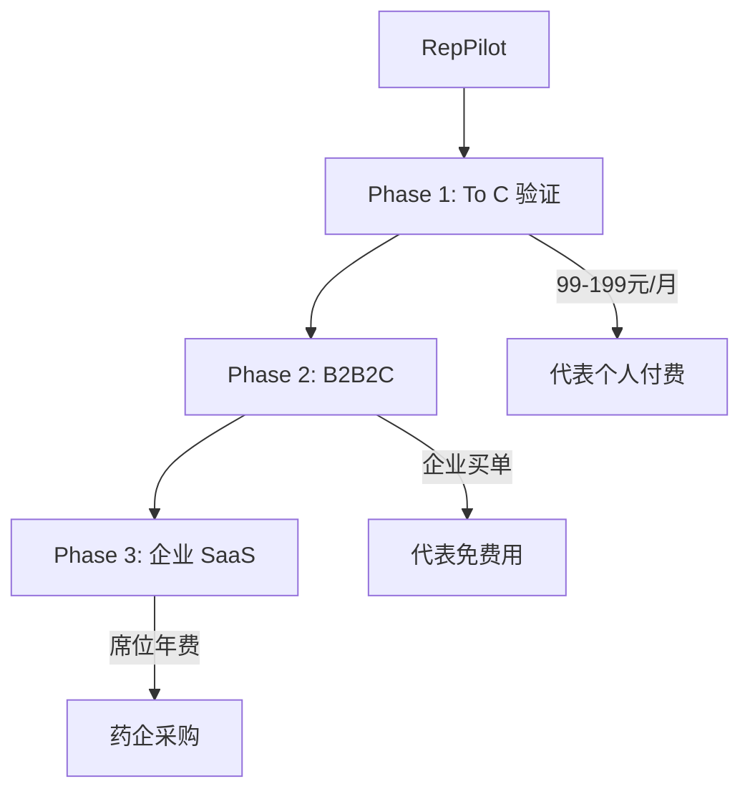

# RepPilot 商业与市场分析

- **版本**：v0.2
- **日期**：2026-07-06
- **对应 Spec**：[`../product/spec.md`](../product/spec.md)
- **项目索引**：[`../README.md`](../README.md)

---

## 1. 市场背景

### 1.1 行业趋势

- 医药推广从 **关系驱动** 转向 **学术专业驱动 + 数字化合规**
- 代表面临：准入复杂（集采/医保/DRG）、产品知识更新快、拜访效率要求更高
- 通用 AI（ChatGPT 等）**无法满足**：合规边界、企业资料 grounding、专科工作流

### 1.2 目标市场

| 层级 | 规模（中国） | 说明 |
|------|--------------|------|
| 医药代表总数 | ~200 万（含 OTC） | 聚焦处方药代表 ~80–100 万 |
| 可触达（初期） | 用户现有客户群 | 冷启动优势 |
| SAM（专科代表） | 按专科逐步扩展 | 先做 1 专科深度 |

---

## 2. 竞品格局

| 类型 | 代表产品/方向 | 优势 | 缺口 |
|------|---------------|------|------|
| **CRM** | Veeva, Salesforce Life Sciences | 企业级、拜访数据 | 无 AI 晨报；Briefing 弱；代表不爱用 |
| **医学资讯** | 丁香园、梅斯、医学界 | 内容丰富 | 非个性化；无拜访闭环 |
| **通用 AI** | ChatGPT, Kimi, 文心 | 通用能力强 | 无合规；无专科推送；无 CRM 闭环 |
| **培训 SaaS** | 各类 e-learning | 合规培训 | 非日常工具；低频 |
| **垂直 AI（新兴）** | 国内外初创 | 探索中 | 多数 To B 重；代表端体验不足 |

### RepPilot 差异化

1. **Daily 入口**：晨报/快讯 → 高频打开
2. **拜访闭环**：访前 → 问答 → 访后
3. **合规内置**：引用溯源 + 禁用词
4. **专科深度**：不是泛医学新闻
5. **H5 + Web 双端**：移动外出 + 桌面深度，无需安装 App；后续可选微信小程序

---

## 3. 商业模式

### 3.1 路径选择

### 3.2 定价假设（待验证）

| 套餐 | 价格 | 包含 |
|------|------|------|
| **个人版** | 99 元/月 / 899 元/年 | 1 专科晨报 + Briefing + 问答（公共资料库） |
| **个人 Pro** | 199 元/月 | + 快讯 + 多 HCP + 历史导出 |
| **企业版** | 800–1500 元/席位/年 | 企业资料库 + 审计 + 定制源 |
| **企业定制** | 项目制 | CRM 集成、多 BU |

### 3.3 单位经济（粗算）

| 项 | 估算 |
|----|------|
| LLM + 基础设施成本/用户/月 | 5–15 元 |
| 毛利率（To C） | 85%+ |
| CAC（靠现有客户群） | 低 |
| LTV（若留存 12 月 × 99 元） | ~1188 元 |

---

## 4. Go-to-Market（GTM）

### 4.1 Phase 1：种子验证（0–2 月）

- **渠道**：现有医药代表客户群
- **目标**：10–20 人 × 2 周深度使用
- **动作**：
  - 免费试用
  - 每周 15 分钟访谈
  - 收集付费意愿与功能排序

### 4.2 Phase 2：专科扩散（2–6 月）

- 代表口碑推荐（邀请奖励）
- 医药代表垂直社群 / 公众号合作
- 病例式内容营销：「心内科代表的一天 with RepPilot」

### 4.3 Phase 3：企业试点（6–12 月）

- 找 1 家区域药企试点企业版
- 卖点：合规审计 + 代表效率 + 培训成本下降
- 决策链：合规部 + 销售运营 + IT

---

## 5. 风险与应对

| 风险 | 影响 | 应对 |
|------|------|------|
| LLM 摘要错误 | 高（信任崩塌） | 人工审核期 + 强制来源链接 |
| 代表付费意愿低 | 中 | 先验证 ROI；走 B2B2C |
| 资讯版权 | 中 | 短摘要 + 跳转；不全文转载 |
| 合规监管 | 高 | 不做处方数据；话术保守 |
| 公众号抓取难 | 低 | Curated 为主 |
| 大厂复制 | 中 | 垂直深度 + 客户网络 + 工作流 |

---

## 6. 关键里程碑

| 时间 | 里程碑 | 成功标准 |
|------|--------|----------|
| M1 | MVP 上线 | 种子用户可用 |
| M2 | 留存验证 | 周活 ≥60% |
| M3 | 首批付费 | ≥10 付费用户 |
| M4 | 第二专科 | 复制模板 |
| M5 | 企业 POC | 1 家药企签约试点 |

---

## 7. 关联

- Spec：[`../product/spec.md`](../product/spec.md)
- Plan：[`../plans/plan.md`](../plans/plan.md)
- 项目索引：[`../README.md`](../README.md)
