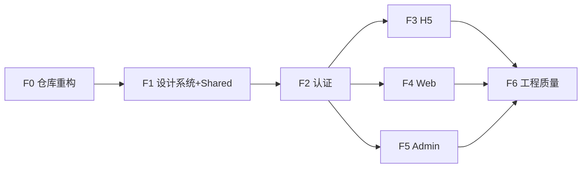

# Codex 任务规划：RepPilot 前端工程化重构

- **对应 Spec**：[`../product/spec.md`](../product/spec.md) · [`../product/admin-spec.md`](../product/admin-spec.md)
- **UI 参考（只读）**：[`reppilot`](../../../reppilot) 内现有 `h5/` · `web/` · `admin/`（Magic Patterns 导出）
- **Magic Patterns 编辑器**：[H5](https://www.magicpatterns.com/c/8fhtf7e7nwwhyqedsfjyxq) · [Web](https://www.magicpatterns.com/c/fmym8gyxshrrcbyoulnjdu) · [Admin](https://www.magicpatterns.com/c/tqyr3td9fnwxd1aqhjnvj5)
- **后端 Plan**：[`plan.md`](./plan.md)（**暂缓**；前端先用 Mock，接口契约对齐 Spec）
- **日期**：2026-07-07
- **版本**：v0.1
- **执行仓库**：[`reppilot`](../../../reppilot)
- **执行者**：Codex

---

## 0. 核心结论（必读）

### Magic Patterns 代码的定位

| 是 | 否 |
|----|-----|
| **UI 视觉参考**（布局、层级、间距、配色、文案占位） | 可复制的生产代码 |
| **产品意图说明**（有哪些屏、有哪些字段） | 路由 / 状态管理 / 数据层实现 |
| **设计 Token 提取来源** | 公共组件库的最终实现 |

**禁止**：把 MP 导出的 `App.tsx` + `useState`  Tab 切换、内联 mock 数据、手写表格直接当生产代码 ship。

**正确做法**：对照 MP 原型 **重写**——保留设计意图，用工程化结构实现。

### MP 导出中必须丢弃的部分

- [ ] `canvas.manifest.js` · `useScreenInit.js` — MP 多屏预览 plumbing
- [ ] `useState` 模拟的全局导航 / Tab 切换 — 改为 **react-router-dom**
- [ ] 组件内硬编码 mock 数组 — 改为 **类型 + Mock API / MSW**
- [ ] 每端重复 copy 的 UI  primitives — 抽到 **`packages/ui-*`**
- [ ] MP 脚手架里散落的 tailwind 任意值 — 收敛到 **Design Token**
- [ ] `data-id` 等编辑器 instrumentation（若存在）

---

## 1. 目标架构

### 1.1 Monorepo 目标结构

将 `reppilot` 从「三个独立 Vite 原型」重构为 **pnpm workspace**：

```
reppilot/
├── pnpm-workspace.yaml
├── package.json                    # 根 scripts：dev:h5 / dev:web / dev:admin / build
├── packages/
│   ├── config/                     # 共享 tsconfig、eslint、tailwind preset
│   ├── shared/                     # @reppilot/shared
│   │   └── src/
│   │       ├── types/              # 与 Spec 对齐的 TS 类型
│   │       ├── api/                # HTTP client、auth、endpoint 常量
│   │       ├── mocks/              # Mock handlers（后端就绪前）
│   │       ├── hooks/              # useAuth、useProfile、useDigest…
│   │       ├── utils/              # format、cn、storage
│   │       └── constants/          # routes、queryKeys
│   ├── ui-user/                    # @reppilot/ui-user（H5 + Web 共用）
│   │   └── src/
│   │       ├── tokens/             # colors、spacing、radii
│   │       └── components/         # Button、Card、Badge、IconCircle…
│   └── ui-admin/                   # @reppilot/ui-admin（Admin 专用）
│       └── src/
│           ├── tokens/
│           └── components/         # DataTable、StatusBadge、StatCard…
├── apps/
│   ├── h5/                         # @reppilot/h5 · m.reppilot.com
│   ├── web/                        # @reppilot/web · app.reppilot.com
│   └── admin/                      # @reppilot/admin · admin.reppilot.com
├── prototype/                      # MP 原始导出归档（只读参考，不参与 build）
│   ├── h5/
│   ├── web/
│   └── admin/
└── README.md
```

**迁移步骤（F0）**：将现有 `h5/`、`web/`、`admin/` **整体移入 `prototype/`**，再在 `apps/` 下 **新建空应用 scaffold**。

### 1.2 三端职责

| App | 路由器 | 布局 | 设计系统 |
|-----|--------|------|----------|
| **h5** | `BrowserRouter` + 底部 Tab Layout | 390px 移动优先、Overlay 全屏子路由 | `@reppilot/ui-user` |
| **web** | `BrowserRouter` + Sidebar Layout | ≥1280px 桌面 | `@reppilot/ui-user` |
| **admin** | `BrowserRouter` + Dark Sidebar Layout | ≥1280px 运营后台 | `@reppilot/ui-admin` |

### 1.3 技术栈（Phase 1 锁定）

| 层 | 选型 | 说明 |
|----|------|------|
| 构建 | Vite 6 + TypeScript | 三 app 统一 |
| 包管理 | **pnpm workspaces** | `packages/*` + `apps/*` |
| 路由 | **react-router-dom v6** | 每端独立 route config |
| 服务端状态 | **TanStack Query v5** | 即使 Mock 也走 query |
| 客户端状态 | React Context 或 Zustand（仅 auth/ui） | 轻量 |
| 样式 | Tailwind CSS 3 + **Design Token** | 禁止散落 arbitrary 值 |
| 图标 | lucide-react | 三端统一 |
| 动效 | framer-motion（按需） | 仅 h5 overlay 等 |
| Mock | **MSW** 或 shared/mocks fetch 层 | 后端未就绪时 |
| 表单 | react-hook-form + zod | 登录、Onboarding、审核表单 |
| 测试 | Vitest + Testing Library | 公共组件 + 关键流程 |

---

## 2. 设计系统规划

### 2.1 用户端 `@reppilot/ui-user`（Apple Health Warmth）

从 MP 原型 **提取 Token，重写组件**：

```ts
// packages/ui-user/src/tokens/colors.ts
export const userColors = {
  bg: '#F2F2F7',
  surface: '#FFFFFF',
  accent: '#30B0C7',
  accentSoft: '#E5F6F9',
  green: '#34C759',
  coral: '#FF6B6B',
  lavender: '#AF52DE',
  orange: '#FF9500',
  text: '#1C1C1E',
  muted: '#8E8E93',
  border: '#E5E5EA',
} as const
```

**公共组件清单（P0）**：

| 组件 | 用途 | MP 参考位置 |
|------|------|-------------|
| `Button` / `GradientButton` | CTA | h5 Login、web Auth |
| `GroupedCard` / `GroupedList` | iOS 分组列表 | h5 Home、web Dashboard |
| `IconCircle` | 分类色圆 icon | 三端列表 |
| `Badge` / `Pill` | 专科、来源 chip | 晨报卡片 |
| `VerifiedBadge` | 来源可信 | 资讯详情 |
| `ActivityRing` | 阅读进度 | h5 Home |
| `Toggle` | 设置开关 | Onboarding、Settings |
| `EmptyState` / `ErrorState` / `LoadingSkeleton` | 三态 | **MP 缺失，必须补** |
| `SourceChip` | 外链来源 | 资讯列表 |

### 2.2 管理端 `@reppilot/ui-admin`（Ops Console）

```ts
export const adminColors = {
  bg: '#FAFAFA',
  surface: '#FFFFFF',
  sidebar: '#111827',
  accent: '#2563EB',
  success: '#059669',
  warning: '#D97706',
  danger: '#DC2626',
  // ...
} as const
```

**公共组件清单（P0）**：

| 组件 | 用途 |
|------|------|
| `StatusBadge` | pending / approved / rejected / L1/L2/L3 |
| `StatCard` | 仪表盘指标 |
| `DataTable` | 通用表格（排序、分页、空态） |
| `FilterBar` | 审核队列筛选 |
| `SplitReviewPanel` | 左编辑右对照（审核详情核心） |
| `ConfirmDialog` | 通过/拒绝/撤回二次确认 |
| `PageHeader` / `AdminShell` | 侧栏 + 顶栏布局 primitives |

### 2.3 H5 与 Web 共享策略

| 共享 | 不共享 |
|------|--------|
| Token、Button、Card、Badge、SourceChip、Empty/Loading | 页面级 Layout（Tab vs Sidebar） |
| `types`、`api`、`hooks` | 路由 path 结构 |
| 业务 Presentational 组件（如 `DigestCard`） | 部分交互（H5 录音、Web 导出 CSV） |

**目标**：`DigestCard`、`NewsItemRow`、`CitationPanel` 等放 `packages/ui-user` 或 `packages/shared` 的 `components/`。

---

## 3. 路由与页面逻辑设计

### 3.1 H5 路由（`apps/h5`）

```text
/                          → redirect /digest
/auth/login
/auth/register
/onboarding                 → 三步 wizard（子路由 /onboarding/1..3）
/digest                     → Tab: 今日（默认）
/briefing                   → Tab: 访前
/qa                         → Tab: 问答
/visits                     → Tab: 记录
/profile                    → Tab: 我的
/notifications              → 全屏 overlay 路由
/alerts/:id                 → 快讯详情
/hcps/:id                   → HCP 详情
/visits/:id                 → 拜访详情
/settings                   → 设置
```

- **Tab Layout**：`/` 下 5 个主 Tab 用 `<Outlet />` + 底部导航
- **全屏子页**：独立 route，带 `navigate(-1)` 返回
- **鉴权**：`ProtectedRoute` — 无 token → `/auth/login`；已登录未完成 Onboarding → `/onboarding`

### 3.2 Web 路由（`apps/web`）

```text
/auth/login | /auth/register
/onboarding
/                           → Dashboard（摘要工作台）
/briefing
/hcps
/qa
/visits
/settings
```

- **禁止**：Web 内嵌「审核队列」— 已迁移至 Admin（移除 MP 原型中的 `AdminReview` 页）
- **Sidebar Layout**：`<AppShell>` 包裹 authenticated routes

### 3.3 Admin 路由（`apps/admin`）

```text
/auth/login
/                           → Dashboard
/review                     → 审核列表（Tab: human / agent-approved / agent-rejected / feedback）
/review/:id                 → 审核详情（SplitReviewPanel）
/sources | /sources/new | /sources/:id
/curated/new
/documents | /documents/:id
/compliance/blocklist
/compliance/qa-logs
/users
/analytics
/settings/admins            → P1
/settings/audit-log         → P1
```

- **鉴权**：独立 `admin_token`；`ProtectedAdminRoute` + 角色 `super_admin` / `content_ops`

---

## 4. 数据层设计（后端未就绪）

### 4.1 类型（`packages/shared/src/types`）

与 Spec §6 / Admin Spec §8 对齐，至少定义：

- `User` · `UserProfile`
- `Digest` · `DigestItem` · `DigestFeedback`
- `Alert` · `NewsItem`
- `HCP` · `Visit` · `Briefing`
- `QARecord` · `Citation`
- `AdminUser` · `ReviewItem` · `ReviewAuditLog`
- `Source` · `ProductDoc`

### 4.2 API Client（`packages/shared/src/api`）

```text
client.ts          # fetch 封装：baseURL、Authorization、错误归一
auth.ts            # login / register / refresh / logout
profile.ts
digest.ts
alerts.ts
hcps.ts
visits.ts
briefing.ts
qa.ts
admin/review.ts
admin/sources.ts
…
```

- `VITE_API_BASE_URL` 环境变量；本地默认 `http://localhost:8000/api`
- **后端暂缓**：`VITE_USE_MOCK=true` 时走 `mocks/handlers.ts`

### 4.3 TanStack Query 约定

| 约定 | 说明 |
|------|------|
| QueryKey | `['digest', 'today']` · `['review', 'list', filters]` |
|  mutation 后 invalidate | 审核通过后 invalidate 相关 list |
| 全局 ErrorBoundary | API 错误 toast |
| StaleTime | 列表 30s；详情 60s |

---

## 5. Codex 任务拆解

### Phase F0 — 仓库重构（Week 1 · 前置）

| ID | 任务 | 输出 | 验收标准 |
|----|------|------|----------|
| F0-1 | 初始化 pnpm workspace | `pnpm-workspace.yaml` + 根 `package.json` | 根目录 `pnpm install` 成功 |
| F0-2 | 归档 MP 原型 | `prototype/{h5,web,admin}/` | 原代码可本地静态预览；**不参与** apps build |
| F0-3 | 创建 `packages/config` | 共享 tsconfig、eslint、tailwind preset | 三 app  extends 同一 base |
| F0-4 | 创建空 `apps/{h5,web,admin}` | Vite + React + TS scaffold | 各 app `pnpm dev` 可启动空白页 |

### Phase F1 — 设计系统 + Shared（Week 1–2）

| ID | 任务 | 输出 | 验收标准 |
|----|------|------|----------|
| F1-1 | `@reppilot/ui-user` tokens + 基础组件 | Button、Card、Badge、IconCircle、Toggle、Skeleton | Storybook 或 `/dev/components` 页可预览；**视觉与 MP 意图一致** |
| F1-2 | `@reppilot/ui-admin` tokens + 基础组件 | StatusBadge、StatCard、DataTable、FilterBar | 同上 |
| F1-3 | `@reppilot/shared` types | 全部核心 TS 类型 | 与 Spec 字段一致；无 `any` |
| F1-4 | `@reppilot/shared` api + mocks | client + MSW handlers | Mock 模式下可 login、拉 digest |
| F1-5 | `@reppilot/shared` hooks | useAuth、useProfile | token 存 localStorage；refresh 预留 |

### Phase F2 — 认证 + Onboarding（Week 2）

| ID | 任务 | 输出 | 验收标准 |
|----|------|------|----------|
| F2-1 | H5 auth 流程 | login/register/onboarding 路由 | zod 校验；Mock 注册成功 → onboarding |
| F2-2 | Web auth 流程 | 同左，桌面布局 | 与 H5 共用 shared hooks |
| F2-3 | Admin login | `/auth/login` | 独立 admin token 存储 key |
| F2-4 | `ProtectedRoute` 组件 | 三端复用模式 | 未登录跳转正确 |

### Phase F3 — H5 核心业务页（Week 2–3）

| ID | 任务 | MP 参考 | 验收标准 |
|----|------|---------|----------|
| F3-1 | Tab Layout + 5 主 Tab | prototype/h5 | react-router；底部 Tab 高亮正确 |
| F3-2 | 今日晨报 `/digest` | HomeScreen | DigestCard 列表；反馈按钮调 mutation |
| F3-3 | 访前 `/briefing` | PreVisitScreen | 选 HCP → 生成（Mock）→ 复制 |
| F3-4 | 问答 `/qa` | QnaScreen | 对话列表 + Citation 卡片 |
| F3-5 | 记录 `/visits` | LogScreen | 录音 UI 占位 + 历史列表 |
| F3-6 | 我的 `/profile` | ProfileScreen | 入口跳转 settings |
| F3-7 | Overlay 子路由 | Notifications、AlertDetail、HCP、Visit、Settings | 返回栈正确；动效可选 |

### Phase F4 — Web 核心业务页（Week 3–4）

| ID | 任务 | MP 参考 | 验收标准 |
|----|------|---------|----------|
| F4-1 | Sidebar Layout | prototype/web Sidebar | **无** AdminReview 菜单项 |
| F4-2 | 工作台 `/` | Dashboard | 统计卡 + 晨报模块；数据与 H5 一致（同源 query） |
| F4-3 | Briefing / HCP / QA / Visits | 对应 pages | 双栏布局；Visits 可导出 CSV（前端） |
| F4-4 | Settings | SettingsPage | 推送开关调 profile mutation |

### Phase F5 — Admin 核心业务页（Week 4–5）

| ID | 任务 | MP 参考 | 验收标准 |
|----|------|---------|----------|
| F5-1 | AdminShell + 侧栏导航 | AdminLayout | 角色菜单差异（content_ops 隐藏发布） |
| F5-2 | 仪表盘 `/` | DashboardPage | 待人工 / Agent 统计分开展示 |
| F5-3 | 审核 `/review` + `/review/:id` | ReviewQueue + ReviewDetail | **SplitReviewPanel**；展示 Agent checks |
| F5-4 | 信息源 / Curated / 资料库 | Sources、Curated、Documents | CRUD 表单 + Mock |
| F5-5 | 合规 / 用户 / 统计 | Blocklist、QaAudit、Users、Analytics | 只读表格 + 筛选 |

### Phase F6 — 工程质量（Week 5–6）

| ID | 任务 | 输出 | 验收标准 |
|----|------|------|----------|
| F6-1 | H5 PWA | manifest + SW 基础 | 可「添加到主屏幕」 |
| F6-2 | 响应式与 a11y 基线 | focus、aria-label、键盘 | Lighthouse a11y ≥ 90 |
| F6-3 | 错误/空/加载三态 | 全页面覆盖 | 无白屏 |
| F6-4 | 环境变量文档 | `.env.example` 三 app | API_URL、USE_MOCK 说明 |
| F6-5 | 构建 CI | `pnpm build` 三 app | dist 可部署 |

---

## 6. 执行顺序



**并行建议**：F3 / F4 / F5 可在 F2 完成后由 Codex **分端并行**（共享 F1 组件冻结后）。

---

## 7. 与后端 Plan 的衔接

| 阶段 | 前端 | 后端（plan.md · 暂缓） |
|------|------|------------------------|
| 现在 | `VITE_USE_MOCK=true`，MSW 返回 Spec 结构数据 | 不开发 |
| 后端就绪后 | 改 env + 替换 handlers 为真实 API | T3/T11a/T10… |
| 契约对齐 | `packages/shared/types` 为 **单一事实来源** | OpenAPI 生成 types（Phase 2 可选） |

**原则**：Mock 数据结构必须与 Spec 一致，避免后端联调时大面积改 UI。

---

## 8. Codex 安全约束

- **不得**把 `prototype/` 代码 copy 到 `apps/` 完事
- **不得**在三端重复实现相同 Button/Table
- **不得**在组件内硬编码 API URL
- **不得**恢复 Web 端「审核队列」入口
- **必须**用 react-router 管理导航；**禁止** MP 式 `useState('home')` 切 Tab
- **必须**补全 Loading / Empty / Error 三态
- Admin 与用户端 **token 存储 key 分离**

---

## 9. 完成自检

- [ ] `prototype/` 仅作参考，apps 内无 MP plumbing 文件
- [ ] pnpm workspace 三 app + packages 可一键 build
- [ ] H5 / Web 视觉与 MP **意图一致**，但代码结构工程化
- [ ] Admin 四 Tab 审核队列 + SplitReviewPanel 可用（Mock 数据）
- [ ] 公共组件有文档或预览页
- [ ] 切换 `VITE_USE_MOCK=false` 时只需改 env（接口未实现时可 501，不 crash）
- [ ] Web **无** AdminReview 页面

---

## 10. 回传

Codex 完成后：

1. 更新本文件任务勾选
2. 更新 [`reppilot/README.md`](../../../reppilot/README.md) 目录说明
3. 后端启动联调时同步 [`plan.md`](./plan.md) 的 T5a/b/c 状态
