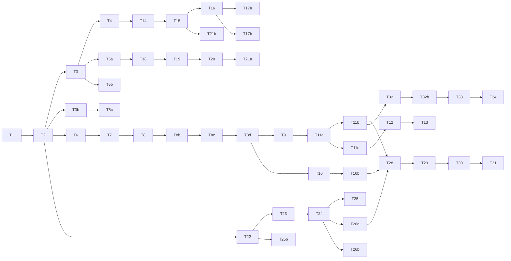

# Codex 任务规划：RepPilot 医药代表智能助手

- **对应 Spec**：[`../product/spec.md`](../product/spec.md) · [`../product/admin-spec.md`](../product/admin-spec.md)
- **技术架构**：[`../tech/architecture.md`](../tech/architecture.md)
- **项目索引**：[`../README.md`](../README.md)
- **日期**：2026-07-07
- **版本**：v0.3（H5 + Web + Admin 三端；Agent 审核；前后端分仓）
- **状态**：后端 **暂缓**；**前端工程化重构优先**（见 [`frontend-plan.md`](./frontend-plan.md)）
- **代码仓库**：
  - 前端：[`reppilot`](../../../reppilot) — **Codex 按 frontend-plan 重构**
  - 后端：**`reppilot-api`**（独立仓库，暂缓）

---

## 前端重构（优先 · 与后端解耦）

Magic Patterns 导出代码 **仅作 UI 参考**，不可直接用于生产。Codex 应优先执行：

→ **[`frontend-plan.md`](./frontend-plan.md)**（F0–F6：pnpm workspace、设计系统、路由、Mock 数据层、三端页面重写）

本文件 Phase 1 中的 **T5a/b/c** 及后续前端对接任务，**依赖 frontend-plan 完成后再启用**。

---

## 前置条件

- [ ] 产品名、MVP 首发专科最终确认
- [x] 注册方式：**邮箱+密码**（手机号 OTP 预留）
- [ ] 域名 + HTTPS 已就绪（Web Push 硬性要求；三域名：m / app / admin）
- [ ] 至少 1 套产品合规资料 PDF 就绪
- [ ] 首发专科信息源白名单初版（≥15 源）
- [ ] **GPT API Key**（摘要 / 审核）与 **Qwen API Key**（RAG）可用
- [ ] pgvector 环境可用（Docker Compose 内置）
- [ ] VAPID 密钥对已生成（Web Push）

---

## 安全约束（Codex 必须遵守）

- 问答模块：**无 citations 不得返回确定性答案**（Qwen RAG）
- 所有 LLM 输出经 `ComplianceFilter` 后再返回
- 用户数据按 `user_id` 严格隔离；**Admin 独立 JWT**（`aud=admin`）
- **未经 `approved` 的 NewsItem 不得出现在用户 API**
- **快讯 MVP 始终 L3 人工**；**Curated 始终 L3 人工**（Agent 不得直出）
- Agent 自动通过/拒绝/升级 L3：**必须**写 `review_audit_logs`
- Agent 判官失败或超时 → **降级 L3**，不自动通过
- 密码 bcrypt/argon2；JWT Bearer + 短过期 + refresh rotation
- 爬虫仅白名单域名；遵守 robots.txt
- 不在代码/日志中硬编码 API Key
- 语音文件加密存储；30 天自动清理
- **禁止实现**：微信小程序、微信登录、处方数据接口、CRM 写入、**零人工全自动审核**

---

## Phase 1 — MVP（4–6 周）

### Sprint 1：reppilot-api 基础 + 认证 + 画像（Week 1）

| ID | 任务 | 输入 | 输出 | 验收标准 | 依赖 |
|----|------|------|------|----------|------|
| T1 | 初始化 **reppilot-api** | architecture §3.2 | FastAPI + Celery + **docker-compose**（pg/redis/minio/api/worker/beat） | `docker compose up` 可启动；README 含 env | — |
| T2 | PostgreSQL migration | Spec §6 + Admin Spec §8 | Alembic migrations | users(email)、admin_users、PushSubscription、Notification、review_audit_logs 扩展字段 | T1 |
| T3 | 用户认证 API | 邮箱+密码 | `POST /api/v1/auth/register|login|refresh` | 注册登录可用；`users.phone` nullable 预留 | T1, T2 |
| T3b | Admin 认证 API | Admin Spec | `POST /api/admin/v1/auth/login` | 独立 JWT；角色 super_admin / content_ops | T2 |
| T4 | 用户画像 API | specialty, product_tags, push_time | `GET/PATCH /api/v1/profile` | Onboarding 字段可读写 | T3 |
| T5a | H5 对接 API | reppilot/apps/h5 + frontend-plan F3 | 登录/Onboarding/主 Tab 调 API 或 Mock | **frontend-plan F2–F3 完成后** |
| T5b | Web 对接 API | reppilot/apps/web + frontend-plan F4 | 侧栏布局；**无** AdminReview | **frontend-plan F2、F4 完成后** |
| T5c | Admin 对接 API | reppilot/apps/admin + frontend-plan F5 | Admin 登录 + 审核队列 Mock/API | **frontend-plan F2、F5 完成后** |

### Sprint 2：资讯管线 + Agent 审核 + 个性化晨报（Week 2–3）

| ID | 任务 | 输入 | 输出 | 验收标准 | 依赖 |
|----|------|------|------|----------|------|
| T6 | Source 白名单 seed | 15–20 源 JSON | sources 表 + seed 脚本 | 心内科源可导入 | T2 |
| T7 | RSS/HTTP 抓取器 | Source 配置 | Celery `fetch_sources` | 每 4h 运行；去重 by url | T6 |
| T8 | **GPT** 摘要与打标签 | NewsItem raw | llm_summary, tags, importance_score | JSON 结构化输出 | T7 |
| T8b | Agent ReviewPipeline v0 | 规则检查器 | SourceTrust + UrlReachability + Compliance | 输出 L1/L2/L3 建议 | T8 |
| T8c | Agent ReviewPipeline v1 | GPT 忠实度检查 | SummaryFaithfulness + SpecialtyTag | faithfulness_score；失败降级 L3 | T8b |
| T8d | 审核 Celery job | ReviewPipeline | news_items.status + review_audit_logs | L1→approved；L2→rejected；L3→pending_human | T8c |
| T9 | 晨报生成 job | approved 池 + **Digest Ranker** | digests + digest_items | **每用户** Top5+headline；含 chat_tip(GPT) | T8d, T4 |
| T10 | Admin 审核 API | Admin Spec §4.2 | `/api/admin/v1/review` 四 Tab | 人工通过/拒绝/改摘要/撤回 | T8d |
| T10b | Admin 审核 UI 对接 | reppilot/admin | 三队列 + Agent 检查报告展示 | 运营可处理 L3；超管可撤回 L1 | T10, T5c |
| T11a | 晨报 API | Digest | `GET /api/v1/digest/today` | 仅返回 approved 条目；个性化结构 | T9 |
| T11b | H5 晨报页对接 | T11a | 卡片列表 + 反馈按钮 | 来源可外链；展示 edited_summary | T11a, T5a |
| T11c | Web 晨报工作台对接 | T11a | 工作台晨报模块 | 与 H5 数据一致 | T11a, T5b |
| T12 | 通知系统 | Digest/Alert | Notification 表 + API | 站内未读徽章可用 | T11a |
| T13 | Web Push | VAPID + subscription API | push 发送服务 | 授权用户 07:30 可收到 | T12 |

**冷启动（T8d 配置）**：`REVIEW_COLD_START_DAYS=14` 期间全部 L3 人工，用于校准 Agent 阈值。

### Sprint 3：访前 Briefing + 访后记录（Week 3–4）

| ID | 任务 | 输入 | 输出 | 验收标准 | 依赖 |
|----|------|------|------|----------|------|
| T14 | HCP CRUD | name, hospital, dept | `/api/v1/hcps` | H5 表单 + Web 表格 | T4 |
| T15 | Visit CRUD | 结构化字段 | `/api/v1/visits` | 关联 hcp_id | T14 |
| T16 | Briefing Agent | hcp + visits + digest | `POST /api/v1/briefing/generate` | Spec §4.3 输出结构（GPT） | T15, T11a |
| T17a | H5 Briefing 页对接 | T16 | 选 HCP → 生成 → 复制 | 3 步完成 | T16, T5a |
| T17b | Web Briefing 页对接 | T16 | 左 HCP 列表 / 右结果 | 可查看历史 Visit | T16, T5b |
| T18 | 浏览器录音 + 上传 | MediaRecorder | audio → MinIO | H5 Chrome/Safari 可录 | T5a |
| T19 | ASR 转写 API | audio file | transcript text | 60s 内可转写 | T18 |
| T20 | Visit 结构化 Agent | transcript | Visit JSON（GPT） | 字段完整率 ≥80% | T19, T15 |
| T21a | H5 访后记录页对接 | T20 | 录音 → 预览 → 保存 | 保存后 HCP 详情可见 | T20 |
| T21b | Web 拜访历史页对接 | T15 | 列表 + 详情 + 导出 CSV | 筛选可用 | T15, T5b |

### Sprint 4：合规问答 + Admin 资料库 + 联调（Week 4–5）

| ID | 任务 | 输入 | 输出 | 验收标准 | 依赖 |
|----|------|------|------|----------|------|
| T22 | 产品资料 upload + 切块 | PDF | product_docs + doc_chunks | Admin 可上传 1 产品 | T2 |
| T23 | 向量索引 | chunks | pgvector index | top-k 检索可用 | T22 |
| T24 | **Qwen** RAG 问答链 | question | answer + citations | 无命中拒答 | T23 |
| T25 | ComplianceFilter | 禁用词表 | middleware | 5 个 case 全拦截 | T24 |
| T25b | Admin 资料库 API | Admin Spec §4.5 | upload/publish/recall | 仅超管可 publish | T22, T3b |
| T26a | H5 问答页对接 | T24 | 对话 UI + 引用卡片 | 引用展示正确 | T24, T5a |
| T26b | Web 问答页对接 | T24 | 左对话 / 右引用 | 宽屏布局 | T24, T5b |
| T27 | H5 PWA manifest | — | manifest.json + SW 基础 | 可「添加到主屏幕」 | T5a |
| T28 | 端到端联调 | 全流程 | bugfix | H5/Web/Admin 主路径通 | T11–T26 |
| T29 | 部署 staging | 单机 Docker Compose + Nginx | HTTPS 三域名 | 种子用户可访问三端 | T28 |

### Sprint 5：快讯 + 反馈闭环 + 测试（Week 5–6）

| ID | 任务 | 输入 | 输出 | 验收标准 | 依赖 |
|----|------|------|------|----------|------|
| T30 | 快讯规则引擎 | importance_score | alert 候选 → **强制 L3** | Spec §4.2 规则 | T8 |
| T31 | 快讯推送 | **人工**审核通过 | Web Push + 站内 | 日上限 2 条/用户 | T30, T13, T10 |
| T32 | 反馈 API | useful/not_relevant | digest_feedback 表 | 写入后影响 Digest Ranker | T11b |
| T32b | 反馈异常队列 | 用户「摘要有误」 | Admin 反馈 Tab + 来源降权 | 命中后收紧 Agent 阈值 | T32, T10 |
| T33 | Admin 仪表盘 + 统计 | Agent 统计 + 用户指标 | `/api/admin/v1/dashboard` + analytics | Agent L1/L2/L3 计数可见 | T29 |
| T34 | 种子用户测试文档 | — | 测试指南 | H5 + Web + Admin checklist | T33 |

---

## Phase 2 — 产品化（Week 7–12，概要）

| ID | 任务 | 验收标准 |
|----|------|----------|
| T35 | 邮件晨报摘要（fallback） | 未开 Push 用户可收邮件 |
| T36 | Digest Ranker 深度个性化 | 协同过滤 / 更多反馈信号 |
| T37 | 手机号 OTP 登录 | 启用 `phone_otp.py` |
| T38 | Agent 阈值 Admin 可配 | 超管 UI 调 L1/L2 阈值 |
| T39 | 快讯延迟推送窗口 | Agent 通过后 30min 可撤回再推 |
| T40 | 资料医学审批流 | 医学顾问审 → 超管发布 |
| T41 | 第二专科模板 | 配置化上线 |
| T42 | Service Worker 离线缓存 | 已读晨报离线可看 |
| T43 | 审计导出 CSV | 合规交付 |

---

## Phase 3 — To B + 可选微信（Week 13+，概要）

| ID | 任务 | 验收标准 |
|----|------|----------|
| T44 | 企业租户 + 资料库隔离 | multi-tenant |
| T45 | 合规审计导出 PDF | To B 交付 |
| T46 | CRM 只读 POC | 可选 |
| T47 | 微信小程序（可选） | 仅当用户明确要求 |

---

## 建议执行顺序

---

## 技术栈（Phase 1 锁定）

| 层 | 选型 |
|----|------|
| **H5** | React 18 + Vite + Tailwind（[`reppilot/h5`](../../../reppilot/h5)） |
| **Web** | React 18 + Vite + Tailwind（[`reppilot/web`](../../../reppilot/web)） |
| **Admin** | React 18 + Vite + Tailwind（[`reppilot/admin`](../../../reppilot/admin)） |
| **API** | Python FastAPI（**`reppilot-api`** 独立仓库） |
| **DB** | PostgreSQL 15 + pgvector |
| **队列** | Celery + Redis |
| **摘要 / 审核 / Briefing** | **OpenAI GPT**（gpt-4o-mini 等） |
| **RAG 问答** | **通义 Qwen**（qwen-max 等） |
| **Embedding** | bge-m3 或 text-embedding-3-small |
| **ASR** | 阿里云语音识别 / Whisper API |
| **对象存储** | MinIO（Compose）/ 阿里云 OSS |
| **推送** | web-push (VAPID) + 站内 Notification |
| **部署** | **单机 Docker Compose** + Nginx HTTPS（三域名） |

---

## 完成后自检

- [ ] H5 + Web 均可**邮箱注册**登录并完成 Onboarding
- [ ] Admin 可登录；L3 人工队列可审核；Agent L1 条目可查看/撤回
- [ ] **冷启动期** 100% L3；校准后 L1 自动通过晨报条目
- [ ] **快讯仅人工通过后**推送；Curated 仅人工通过
- [ ] 07:30 Web Push 或站内通知可触达**个性化**晨报
- [ ] H5 访后 60s 录音 → 结构化记录
- [ ] Web 可管理 HCP、导出 Visit CSV
- [ ] 问答 10 题引用正确率 100%（Qwen RAG）
- [ ] Agent 审核 100% 写 audit log
- [ ] **未实现任何微信小程序/微信登录代码**
- [ ] staging HTTPS **三端**可测 2 周

---

## 回传 Cursor

Codex 完成后更新本 plan 任务勾选，并在 [`../product/spec.md`](../product/spec.md) / [`../product/admin-spec.md`](../product/admin-spec.md) 注明「已实现 / 偏差说明」。
