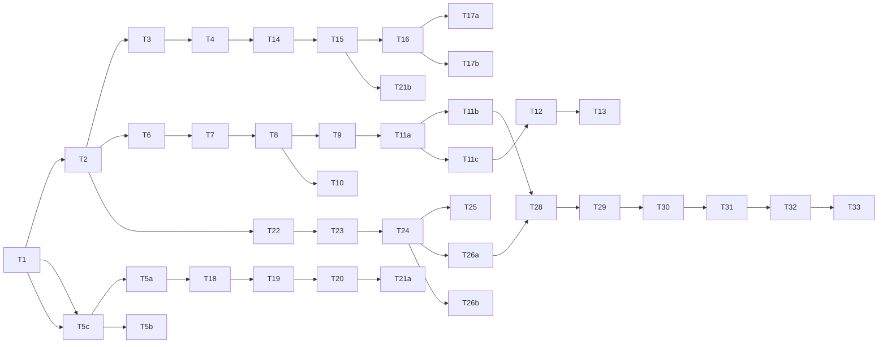

# Codex 任务规划：RepPilot 医药代表智能助手

- **对应 Spec**：[`../product/spec.md`](../product/spec.md)
- **项目索引**：[`../README.md`](../README.md)
- **日期**：2026-07-06
- **版本**：v0.2（H5 + Web 双端，不含微信小程序）
- **状态**：部分可开发（Phase 1 可启动；待用户确认项见 Spec §9）
- **目标代码仓库**：（待用户补充）

---

## 前置条件

- [ ] Spec 中「待用户确认项」已确认：产品名、首发专科、注册方式
- [ ] 域名 + HTTPS 已就绪（Web Push 硬性要求）
- [ ] 至少 1 套产品合规资料 PDF 就绪
- [ ] 首发专科信息源白名单初版（≥15 源）
- [ ] LLM API Key 与向量库环境可用
- [ ] VAPID 密钥对已生成（Web Push）

---

## 安全约束（Codex 必须遵守）

- 问答模块：**无 citations 不得返回确定性答案**
- 所有 LLM 输出经 `ComplianceFilter` 后再返回
- 用户数据按 `user_id` 严格隔离；Admin 独立鉴权
- 密码 bcrypt/argon2；JWT HttpOnly Cookie 或 Bearer + 短过期
- 爬虫仅白名单域名；遵守 robots.txt
- 不在代码/日志中硬编码 API Key
- 语音文件加密存储；30 天自动清理
- **禁止实现**：微信小程序、微信登录、处方数据接口、CRM 写入

---

## Phase 1 — MVP（4–6 周）

### Sprint 1：基础架构 + 双端骨架（Week 1）

| ID | 任务 | 输入 | 输出 | 验收标准 | 依赖 |
|----|------|------|------|----------|------|
| T1 | 初始化 monorepo | Spec | `backend/` + `apps/h5/` + `apps/web/` + `packages/shared/` | 本地可启动；README 含 env | — |
| T2 | PostgreSQL migration | Spec §6 | migration 文件 | 全部表含 PushSubscription、Notification | T1 |
| T3 | 用户认证 API | 手机/邮箱+密码或 OTP | register/login/refresh JWT | 注册登录可用；密码安全存储 | T1, T2 |
| T4 | 用户画像 API | specialty, push_time 等 | POST/GET /profile | Onboarding 字段可读写 | T3 |
| T5a | H5 骨架 | 页面清单 Spec §7.1 | 底部 Tab 5 页可导航 | 移动端视口正常 | T3 |
| T5b | Web 骨架 | 页面清单 Spec §7.2 | 侧边栏布局可导航 | 桌面 1280px 布局正常 | T3 |
| T5c | shared 包 | API types, fetch client | `@rep-pilot/shared` | H5/Web 共用 API 客户端 | T1 |

### Sprint 2：资讯管线 + 晨报（Week 2–3）

| ID | 任务 | 输入 | 输出 | 验收标准 | 依赖 |
|----|------|------|------|----------|------|
| T6 | Source 白名单 seed | 15–20 源 JSON | sources 表 + seed 脚本 | 心内科源可导入 | T2 |
| T7 | RSS/HTTP 抓取器 | Source 配置 | Celery fetch job | 每 4h 运行；去重 by url | T6 |
| T8 | LLM 摘要与打标签 | NewsItem raw | summary, tags, scores | JSON 结构化输出 | T7 |
| T9 | 晨报生成 job | User profile + 候选池 | Digest 记录 | 每用户 ≤5 条；含 chat_tip | T8, T4 |
| T10 | Admin 审核队列 | 待审 NewsItem | Web Admin 页 approve/reject | 运营可审核 | T8, T5b |
| T11a | 晨报 API | Digest | GET /digest/today 等 | 返回完整结构 | T9 |
| T11b | H5 晨报页 | T11a | 卡片列表 + 反馈按钮 | 来源可外链打开 | T11a, T5a |
| T11c | Web 晨报工作台 | T11a | 工作台晨报模块 | 与 H5 数据一致 | T11a, T5b |
| T12 | 通知系统 | Digest/Alert | Notification 表 + API | 站内未读徽章可用 | T11a |
| T13 | Web Push | VAPID + subscription API | push 发送服务 | 授权用户 07:30 可收到 | T12 |

### Sprint 3：访前 Briefing + 访后记录（Week 3–4）

| ID | 任务 | 输入 | 输出 | 验收标准 | 依赖 |
|----|------|------|------|----------|------|
| T14 | HCP CRUD | name, hospital, dept | /hcps API | H5 表单 + Web 表格 | T4 |
| T15 | Visit CRUD | 结构化字段 | /visits API | 关联 hcp_id | T14 |
| T16 | Briefing Agent | hcp + visits + digest | POST /briefing/generate | Spec §4.3 输出结构 | T15, T11a |
| T17a | H5 Briefing 页 | T16 | 选 HCP → 生成 → 复制 | 3 步完成 | T16, T5a |
| T17b | Web Briefing 页 | T16 | 左 HCP 列表 / 右结果 | 可查看历史 Visit | T16, T5b |
| T18 | 浏览器录音 + 上传 | MediaRecorder API | audio blob → OSS | H5 Chrome/Safari 可录 | T5a |
| T19 | ASR 转写 API | audio file | transcript text | 60s 内可转写 | T18 |
| T20 | Visit 结构化 Agent | transcript | Visit JSON | 字段完整率 ≥80% | T19, T15 |
| T21a | H5 访后记录页 | T20 | 录音 → 预览 → 保存 | 保存后 HCP 详情可见 | T20 |
| T21b | Web 拜访历史页 | T15 | 列表 + 详情 + 导出 CSV | 筛选可用 | T15, T5b |

### Sprint 4：合规问答 + 联调（Week 4–5）

| ID | 任务 | 输入 | 输出 | 验收标准 | 依赖 |
|----|------|------|------|----------|------|
| T22 | 产品资料 upload + 切块 | PDF | product_docs + chunks | Admin 可上传 1 产品 | T2 |
| T23 | 向量索引 | chunks | pgvector index | top-k 检索可用 | T22 |
| T24 | RAG 问答链 | question | answer + citations | 无命中拒答 | T23 |
| T25 | ComplianceFilter | 禁用词表 | middleware | 5 个 case 全拦截 | T24 |
| T26a | H5 问答页 | T24 | 对话 + 语音输入 | 引用卡片展示 | T24, T5a |
| T26b | Web 问答页 | T24 | 左对话 / 右引用 | 宽屏布局 | T24, T5b |
| T27 | H5 PWA manifest | — | manifest.json + SW 基础 | 可「添加到主屏幕」 | T5a |
| T28 | 端到端联调 | 全流程 | bugfix | H5/Web 主路径通 | T11–T26 |
| T29 | 部署 staging | Docker compose | HTTPS 域名 | 种子用户可访问双端 | T28 |

### Sprint 5：快讯 + 测试（Week 5–6）

| ID | 任务 | 输入 | 输出 | 验收标准 | 依赖 |
|----|------|------|------|----------|------|
| T30 | 快讯规则引擎 | scores | alert 候选 | Spec §4.2 规则 | T8 |
| T31 | 快讯推送 | 审核通过 | Web Push + 站内 | 日上限 2 条 | T30, T13 |
| T32 | 反馈 API | useful/not_relevant | feedback 表 | 可写入查询 | T11b |
| T33 | 简易数据看板 | — | Admin 打开率/使用统计 | 支持种子测试 | T29 |
| T34 | 种子用户测试文档 | — | 测试指南 | H5 + Web 测试 checklist | T33 |

---

## Phase 2 — 产品化（Week 7–12，概要）

| ID | 任务 | 验收标准 |
|----|------|----------|
| T35 | 邮件晨报摘要（fallback） | 未开 Push 用户可收邮件 |
| T36 | 个性化排序（反馈加权） | 不相关率下降 |
| T37 | 公众号 Curated 入库 | Admin 手动加链 |
| T38 | 第二专科模板 | 配置化上线 |
| T39 | Service Worker 离线缓存 | 已读晨报离线可看 |

---

## Phase 3 — To B + 可选微信（Week 13+，概要）

| ID | 任务 | 验收标准 |
|----|------|----------|
| T40 | 企业租户 + 资料库隔离 | multi-tenant |
| T41 | 合规审计导出 | CSV/PDF |
| T42 | CRM 只读 POC | 可选 |
| T43 | 微信小程序（可选） | 仅当用户明确要求 |

---

## 建议执行顺序

---

## 技术栈（Phase 1 锁定）

| 层 | 选型 |
|----|------|
| **H5** | React 18 + Vite + Tailwind（移动优先） |
| **Web** | React 18 + Vite + Tailwind（桌面布局） |
| **共享** | `packages/shared` — TypeScript API client + types |
| **UI 组件** | shadcn/ui 或 Ant Design Mobile（H5）+ Ant Design（Web） |
| **PWA** | vite-plugin-pwa + Web Push |
| **API** | Python FastAPI |
| **DB** | PostgreSQL 15 + pgvector |
| **队列** | Celery + Redis |
| **LLM** | DeepSeek / 通义 / GPT-4o |
| **ASR** | 阿里云语音识别 / OpenAI Whisper API |
| **对象存储** | 阿里云 OSS / MinIO |
| **推送** | web-push (VAPID) + 站内 Notification |
| **部署** | Docker Compose + Nginx（HTTPS 终结） |

---

## 完成后自检

- [ ] H5 + Web 均可注册登录并完成 Onboarding
- [ ] 07:30 Web Push 或站内通知可触达晨报
- [ ] H5 访后 60s 录音 → 结构化记录
- [ ] Web 可管理 HCP、导出 Visit CSV
- [ ] 问答 10 题引用正确率 100%
- [ ] **未实现任何微信小程序/微信登录代码**
- [ ] staging HTTPS 双端可测 2 周

---

## 回传 Cursor

Codex 完成后更新本 plan 任务勾选，并在 [`../product/spec.md`](../product/spec.md) 注明「已实现 / 偏差说明」。
