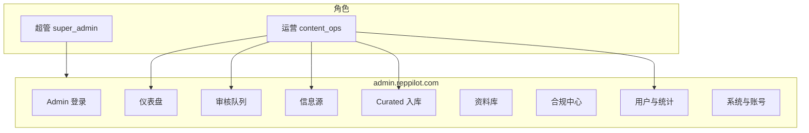
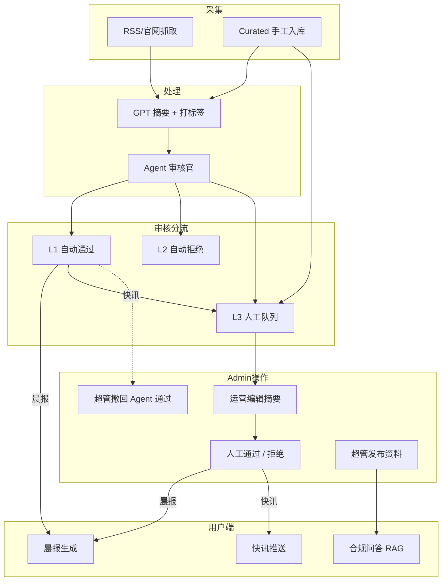
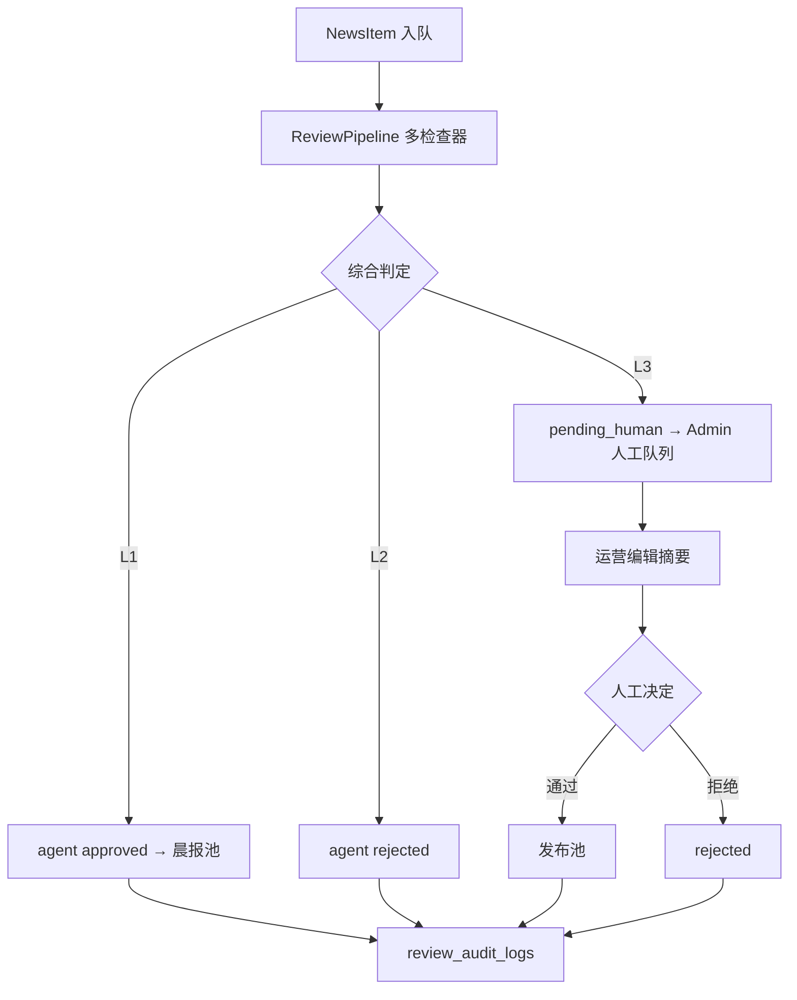
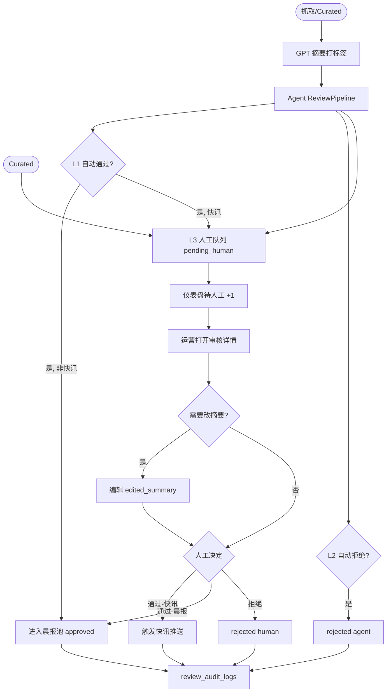
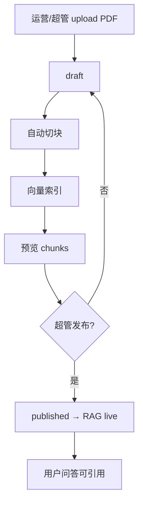
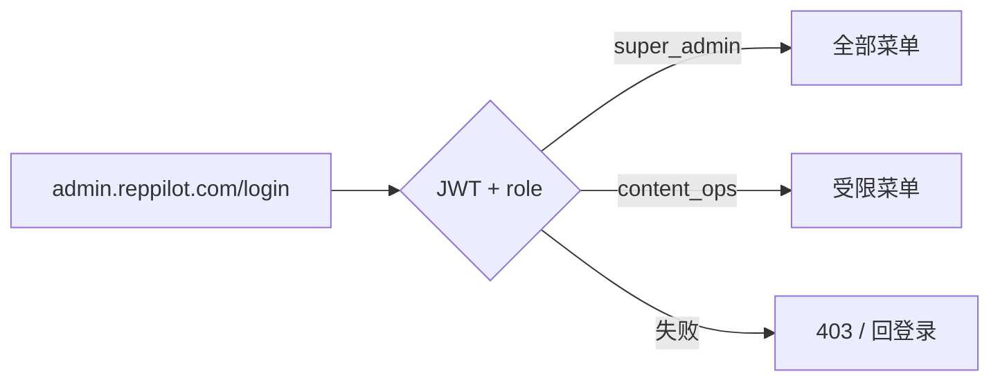
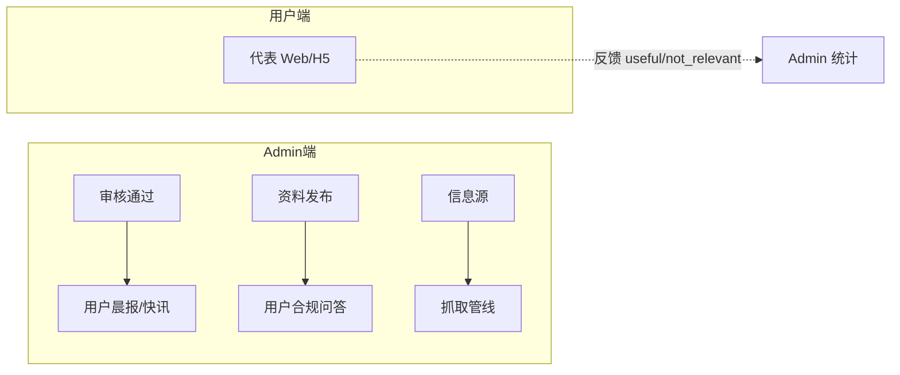

# RepPilot Admin — 后台管理端

- **版本**：v0.2
- **日期**：2026-07-07
- **状态**：有结论（产品层）
- **等级**：L2
- **关键词**：Admin、审核、Agent 审核、信息源、资料库、合规、运营后台
- **访问域名**：`admin.reppilot.com`（与用户端 `app.reppilot.com` / `m.reppilot.com` 独立）
- **后端仓库**：独立 [`reppilot-api`](../../../reppilot-api)（与前端 `reppilot` 分仓）

---

## 1. 背景与目标

### 用户原意

用户端 H5 + Web 已完成 UI 原型。后台管理端负责：**内容从哪来、谁审核、怎么合规、怎么运维**。需在开发前敲定功能边界，再独立设计 Admin UI。

### 要解决的问题

| 痛点 | 产品应对 |
|------|----------|
| AI 摘要不可信 | **Agent 审核为主 + 人工兜底**；高风险/灰区才进人工队列 |
| 运营人力成本高 | Agent 自动通过低风险条目；人工处理例外与抽检 |
| 信息源分散 | 后台统一管理白名单与抓取 |
| 公众号难自动抓 | **Curated 手工入库**（永远人工复核） |
| 问答需合规溯源 | **资料库**统一 upload + 发布 |
| 运营需看效果 | **用户列表 + 简易统计** |

### 已确认决策（2026-07-07，2026-07-07 修订）

| 项 | 决策 |
|----|------|
| 域名 | **独立** `admin.reppilot.com` |
| 审核策略 | **Agent 审核为主 + 人工兜底**（非全量人工、非零人工） |
| 快讯 | MVP **始终人工复核**（或 Agent 通过后延迟推送窗口，Phase 2） |
| Curated | **永远人工复核**（L3） |
| 冷启动 | 上线首 2 周可 100% 人工，用于校准 Agent 阈值 |
| 资料发布 | MVP **超管直接发布**；Phase 2 加医学顾问审批流 |
| 摘要编辑 | 人工队列中运营**必须可编辑** LLM 摘要后再通过 |
| 用户数据 | Admin MVP **包含**用户列表 + 简易统计 |
| 角色 | 第一版 **2 个角色**：超管 + 运营 |
| 后端 | 独立 **`reppilot-api`** 仓库；Admin API 前缀 `/api/admin/v1` |

### 成功指标（Admin MVP）

| 指标 | 目标 |
|------|------|
| 人工队列日处理量 | ≤ 20 条/天（Agent 成熟后） |
| 快讯人工处理时效 | ≤ 2h |
| Agent 误判率 | 抽检 5% 条目，人工纠正率 < 5% |
| 摘要编辑率 | 人工队列中可编辑；错误摘要零流出 |
| 抓取可观测 | 单源失败 15min 内可在仪表盘看到 |
| 操作可追溯 | 100% 审核操作（含 Agent）有 audit log |

### 非目标（Admin MVP）

- 企业多租户 / 席位管理
- 经理团队看板
- 复杂 BI / 自定义报表
- **零人工全自动放行**（医药场景不允许）
- 代表 CRM 数据管理
- 与用户端 Web 共用「审核队列」入口（从代表端移除）

---

## 2. 用户与角色

| 角色 | 代码 | 典型使用者 | 权限范围 |
|------|------|------------|----------|
| **超级管理员** | `super_admin` | 创始人 / 技术负责人 | 全部模块 + 资料发布 + 账号管理 + 禁用词 + 系统配置 |
| **内容运营** | `content_ops` | 运营同事 | 仪表盘、审核队列、信息源、Curated、用户列表/统计（只读） |

### 权限矩阵

| 模块 | 超管 | 运营 |
|------|:----:|:----:|
| 仪表盘 | ✅ | ✅ |
| 审核队列（通过/拒绝/改摘要） | ✅ | ✅ |
| 信息源 CRUD | ✅ | ✅ |
| Curated 入库 | ✅ | ✅ |
| 资料库 upload | ✅ | ✅ |
| 资料库 **发布/下线** | ✅ | ❌ |
| 禁用词管理 | ✅ | ❌ |
| 问答审计 | ✅ | 只读 |
| 用户列表/统计 | ✅ | 只读 |
| 管理员账号 | ✅ | ❌ |
| 操作审计日志 | ✅ | 只读 |

---

## 3. 产品逻辑图

---

## 3.1 Agent 审核策略（2026-07-07 修订）

### 设计原则

- **降人力，不牺牲安全底线**：Agent 处理大量低风险条目；高风险/灰区/特殊类型必须人工。
- **可审计、可撤回、可调阈值**：所有 Agent 决策写 `review_audit_logs`；超管可撤回已自动通过条目。
- **冷启动校准**：上线首 2 周建议 100% 人工，对比 Agent 判断后再逐步放开 L1。

### 三级分流

| 级别 | 条件（示例） | 动作 | 预估占比 |
|------|--------------|------|----------|
| **L1 自动通过** | 高 trust 源 + 摘要忠实度 ≥0.9 + 无合规 flag + 非快讯 + 非 Curated | `approved`，`reviewer_type=agent` | 50–70% |
| **L2 自动拒绝** | 来源不可信 / 忠实度 &lt;0.7 / 命中禁用词 / URL 不可达 | `rejected`，`reviewer_type=agent` | 15–25% |
| **L3 人工复核** | 灰区分数、新来源、**Curated**、**快讯**、Agent 置信度 &lt;0.85 | `pending_human` → 人工决定 | 10–30% |

### Agent 检查器（ReviewPipeline）

| 检查器 | 类型 | 说明 |
|--------|------|------|
| SourceTrustCheck | 规则 | 白名单域名、`trust_level` |
| UrlReachabilityCheck | 规则 | HTTP 200、非钓鱼域 |
| SummaryFaithfulnessCheck | GPT | 摘要 vs 原文 entailment，输出 0–1 分 |
| ComplianceCheck | 规则 + GPT | 禁用词 + 绝对化/超适应症表述 |
| SpecialtyTagCheck | GPT | 专科标签与内容一致性 |
| ImportanceCalibration | 规则 | 防止分数通胀、快讯误触 |

### 安全底线（不可妥协）

| 规则 | MVP 行为 |
|------|----------|
| **快讯** | **始终 L3 人工**（MVP 默认） |
| **Curated** | **始终 L3 人工** |
| **用户反馈「摘要有误」** | 自动降级该来源 Agent 通过率；条目进入复盘队列 |
| **Agent 自动通过** | 超管可在 Admin **只读队列中撤回** |
| **未经 approved** | 不得出现在用户 API |

## 4. 功能模块详述

### 4.1 仪表盘 Dashboard — P0

**目的**：运营每日第一站，掌握系统健康与待办。

| 元素 | 说明 |
|------|------|
| 待人工复核 | L3 队列数量（快讯 / 晨报 / Curated 分 Tab） |
| Agent 今日自动通过 | L1 计数 + 平均置信度 |
| Agent 今日自动拒绝 | L2 计数 |
| 今日晨报 | 是否已生成、计划推送时间、状态 |
| 抓取状态 | 上次全量抓取时间、成功源数 / 失败源数 |
| 核心指标 | 注册用户、昨日 DAU、晨报打开率（7 日简图可选） |
| 异常列表 | 抓取失败源、LLM 失败、Agent 判官失败、推送失败（最近 5 条） |
| 反馈异常 | 用户「摘要有误」/ `not_relevant` 激增条目 |
| 快捷入口 | 进入人工队列、Agent 已通过（只读）、添加 Curated、上传资料 |

---

### 4.2 审核队列 Content Review — P0（核心）

**策略**：**Agent 审核为主 + 人工兜底**。Admin 审核队列聚焦 **L3 人工复核** 与 **例外处理**，不再是全量逐条人工。

#### 队列 Tab（MVP）

| Tab | 内容 | 操作 |
|-----|------|------|
| **待人工复核** | L3：`pending_human` | 编辑摘要、通过、拒绝 |
| **Agent 已通过** | L1：`approved` + `reviewer_type=agent` | 只读；超管可撤回 |
| **Agent 已拒绝** | L2：`rejected` + `reviewer_type=agent` | 只读；运营可申诉恢复 |
| **反馈异常** | 用户举报「摘要有误」/ 高 `not_relevant` | 优先复核 |

#### 列表字段

| 字段 | 说明 |
|------|------|
| 标题 | 原始标题 |
| 摘要预览 | `edited_summary` 或 LLM 摘要前 80 字 |
| 来源 | Source 名称 + trust_level |
| 专科标签 | 如心内科 |
| 重要性分 | 0–100 |
| 类型建议 | 系统建议：快讯 / 晨报 |
| 审核层级 | L1 / L2 / L3 |
| 审核者 | `agent` / `human` + 置信度 |
| 提交时间 | 入队时间 |
| 状态 | `pending_human` / `approved` / `rejected` |

#### 审核详情页（双栏）

| 左栏 | 右栏 |
|------|------|
| **可编辑摘要**（textarea，人工队列必可改） | 原文链接 + iframe/摘要预览 |
| 专科标签（可调整） | 来源 metadata |
| 重要性分（可调整） | 抓取原始内容 |
| 通过类型：○ 快讯 ○ 仅晨报 | GPT 原始输出（只读对照） |
| — | **Agent 检查报告**（各检查器分数 + 升级 L3 原因） |

#### 操作

| 操作 | 说明 | 权限 |
|------|------|------|
| **通过** | 写入发布池；快讯触发推送 job | 超管、运营（仅 L3 队列） |
| **拒绝** | 必填原因；不入用户端 | 超管、运营 |
| **保存草稿** | 改摘要未决定 | 超管、运营 |
| **撤回** | 将 Agent 已通过条目下架 | **仅超管** |
| **申诉恢复** | 将 Agent 已拒绝条目重新入 L3 | 超管、运营 |

#### 审核规则

| 类型 | 规则 |
|------|------|
| **快讯** | MVP **始终 L3 人工**；通过后进入推送队列 |
| **晨报候选** | L1 Agent 可自动通过（冷启动后）；L3 人工可编辑摘要 |
| **Curated** | **始终 L3 人工** |
| **拒绝** | 永不触达用户；记录原因 |
| **Agent L1 通过** | 可直接进晨报池；超管可撤回 |

---

### 4.3 信息源管理 Sources — P0

| 功能 | 说明 |
|------|------|
| 列表 | 名称、URL、fetch_method、专科、trust_level、启用状态、上次抓取 |
| 新增/编辑 | 表单 CRUD |
| 启用/停用 | Toggle |
| 测试抓取 | 手动触发，返回条数 + 样例标题 |
| 抓取日志 | 最近 10 次：时间、状态、条数、错误信息 |

**fetch_method 枚举**：`rss` | `html_list` | `manual`

---

### 4.4 Curated 手工入库 — P0

| 步骤 | 说明 |
|------|------|
| 1 | 粘贴 URL + 可选标题 |
| 2 | 系统拉取 / LLM 生成摘要与标签 |
| 3 | 运营编辑确认 |
| 4 | **提交审核** → 进入审核队列（不直达用户） |

| 字段 | 说明 |
|------|------|
| 来源名称 | 如「心血管时间」公众号 |
| 专科 | 默认当前启用专科 |
| 原文 URL | 必填 |

---

### 4.5 产品资料库 Knowledge Base — P0

| 功能 | 说明 |
|------|------|
| 列表 | 产品名、版本、状态(draft/published/archived)、upload 时间、chunk 数 |
| 上传 | PDF/Word；关联 product_name、SKU |
| 切块预览 | chunk 列表 + 文本预览 |
| 重建索引 | 触发 embedding job |
| **发布** | 仅 **超管**；发布后进入 RAG  live 库 |
| **下线** | 仅超管；下线后问答不可引用 |

**MVP 流程**：upload → draft → 超管发布 → live  
**Phase 2**：upload → 医学顾问审 → 超管发布

---

### 4.6 合规中心 Compliance — P1

| 功能 | 说明 | MVP |
|------|------|-----|
| 禁用词表 | 增删改 `blocked_patterns` | ✅ 超管 |
| 问答审计 | 只读列表：用户、问题、回答、citations、flags、时间 | ✅ |
| 用户错误报告 | 「摘要有误」反馈 | Phase 2 |
| 审计导出 | CSV | Phase 2 |

---

### 4.7 用户与统计 Users & Analytics — P1

#### 用户列表

| 字段 | 说明 |
|------|------|
| ID / 邮箱 | 脱敏展示（MVP 主标识） |
| 手机 | 预留字段，MVP 可为空 |
| 姓名 | |
| 专科 | |
| 注册时间 | |
| 最后活跃 | |
| 状态 | active / disabled |

#### 简易统计

| 指标 | 说明 |
|------|------|
| 注册总数 | |
| DAU / WAU | |
| 晨报打开率 | 7 日 |
| Briefing 生成次数 | |
| 问答次数 | |
| 反馈 | 有用 vs 不相关 比 |

---

### 4.8 系统与账号 Settings — P1

| 功能 | 说明 | 权限 |
|------|------|------|
| 管理员账号 | 创建/禁用超管、运营账号 | 超管 |
| 操作审计日志 | 谁（含 Agent 版本）、何时、对哪条 NewsItem、操作类型 | 超管只读；运营只读 |
| Agent 阈值配置 | L1/L2 阈值、检查器开关（MVP 超管只读 env） | 超管 |

---

## 5. 主流程

### 5.1 资讯审核主路径

### 5.2 资料发布主路径

### 5.3 Admin 登录与鉴权

---

## 6. 页面清单

| # | 页面 | 路由 | 优先级 | 角色 |
|---|------|------|--------|------|
| 1 | 登录 | `/login` | P0 | 全部 |
| 2 | 仪表盘 | `/` | P0 | 全部 |
| 3 | 审核队列 | `/review` | P0 | 全部 |
| 4 | 审核详情 | `/review/:id` | P0 | 全部 |
| 5 | 信息源列表 | `/sources` | P0 | 全部 |
| 6 | 信息源编辑 | `/sources/new`, `/sources/:id` | P0 | 全部 |
| 7 | Curated 入库 | `/curated/new` | P0 | 全部 |
| 8 | 资料库列表 | `/documents` | P0 | 全部 |
| 9 | 资料详情/上传 | `/documents/:id` | P0 | 超管发布 |
| 10 | 禁用词 | `/compliance/blocklist` | P1 | 超管 |
| 11 | 问答审计 | `/compliance/qa-logs` | P1 | 超管 / 运营只读 |
| 12 | 用户列表 | `/users` | P1 | 全部（运营只读） |
| 13 | 使用统计 | `/analytics` | P1 | 全部（运营只读） |
| 14 | 管理员账号 | `/settings/admins` | P1 | 超管 |
| 15 | 操作日志 | `/settings/audit-log` | P1 | 超管 / 运营只读 |

**Magic Patterns MVP 设计范围**：1–13（Phase 1 视觉稿）

---

## 7. 与用户端关系

- 用户端 Web **移除**「审核队列」菜单项（已在代表端原型中占位，正式版迁移至 Admin）
- 用户端只消费 **已 approved** 的内容与 **published** 资料

---

## 8. 数据对象（Admin 扩展）

| 对象 | 关键字段 | 说明 |
|------|----------|------|
| **AdminUser** | id, email, password_hash, role, status | 后台账号 |
| **NewsItem** | + status, review_tier(L1/L2/L3), reviewer_type(agent/human), reviewed_by, reviewed_at, reject_reason, edited_summary, agent_confidence, agent_checks(jsonb), version | 扩展审核字段 |
| **ReviewAuditLog** | id, news_item_id, reviewer_type, reviewer_id(nullable), agent_version, action, confidence, checks(jsonb), before, after, at | Agent + 人工审计 |
| **Source** | （同用户端 spec）+ agent_auto_approve_rate 统计 | |
| **ProductDoc** | + status: draft/published/archived, published_by, published_at | |
| **BlocklistEntry** | id, pattern, action, created_by | |
| **AdminAuditLog** | id, admin_id, module, action, target_id, at | 全局操作日志 |

---

## 9. 界面与交互要点

### 设计风格（与用户端区分）

| 维度 | 用户端 H5/Web | Admin 后台 |
|------|---------------|------------|
| 气质 | Apple Health 温暖、关怀 | **运营效率、审核清晰、信息密度高** |
| 参考 | Health / 报刊 | Linear / Stripe Dashboard / Retool |
| 色彩 | 暖灰 + 健康绿 + 柔和彩 | **中性灰白 + 单一强调色（蓝或青）+ 状态色** |
| 布局 | 卡片、圆角、留白 | **侧栏 + 表格 + 双栏审核** |
| 状态 | 进度环、软 pill | **Badge：pending/approved/rejected** |

### 审核详情交互要点

- 左编辑右对照，**保存前可预览**用户端展示样式
- 通过前二次确认：「确认发布至 N 位心内科用户？」
- 拒绝必填原因（下拉 + 自定义）

---

## 10. 边界情况

| 情况 | 期望行为 |
|------|----------|
| Agent L1 误通过 | 超管撤回；降级该来源自动通过率；写入 audit |
| 运营点发布资料 | 403，提示联系超管 |
| 同一条被两人同时审 | 乐观锁 / 后提交者提示「已被处理」 |
| 通过后撤回 | Agent 通过：超管可撤回；人工通过：MVP 不支持，Phase 2 软删除 |
| 抓取全失败 | 仪表盘红色告警；晨报可发「今日暂无重磅」 |
| 摘要为空通过 | 拦截，必填摘要 |
| 用户反馈摘要有误 | 条目进反馈异常队列；相关来源 Agent 阈值收紧 |
| Agent 判官超时/失败 | 降级 L3 人工，不自动通过 |

---

## 11. 安全与边界

### 鉴权

- Admin 独立 JWT，与用户端 token **隔离**
- 所有 `/admin/*` API 校验 role
- 登录失败限流；可选 IP 白名单（生产）

### 审计

- Agent 自动通过/拒绝：**必须**写 ReviewAuditLog（含 checks、confidence、agent_version）
- 人工通过/拒绝/改摘要/撤回：**必须**写 ReviewAuditLog
- 资料发布/下线：写 AdminAuditLog
- 日志不可物理删除

### 禁止项

- 运营不能发布资料、不能改禁用词、不能管 Admin 账号、**不能撤回 Agent 通过**
- 未经 **approved** 的 NewsItem **不得**出现在用户 API
- **快讯不得 Agent 直出**（MVP）
- **Curated 不得 Agent 直出**
- Admin 不能查看代表 Visit 详情内容（MVP；Phase 2 To B 再议）

### 待用户确认项

- [x] 独立域名 admin.reppilot.com
- [x] Agent 审核为主 + 人工兜底（修订自全量人工）
- [x] 快讯 MVP 始终人工
- [x] Curated 始终人工
- [x] 2 角色：超管 + 运营
- [x] 独立后端仓库 reppilot-api
- [ ] Agent L1 阈值上线时间表（建议冷启动 2 周后）

---

## 12. 分期路线图

| 阶段 | Admin 交付 |
|------|------------|
| **MVP** | 仪表盘（含 Agent 统计）、三队列审核、信息源、Curated、资料库、禁用词、QA 审计、用户/统计 |
| **Phase 2** | Agent 阈值 Admin 可配、快讯延迟推送窗口、资料医学审批流、审计导出、反馈分析 |
| **Phase 3** | 多租户、企业合规导出、经理只读 |

---

## 13. 关联

- 用户端 Spec：[`spec.md`](./spec.md)
- 开发 Plan：[`../plans/plan.md`](../plans/plan.md)
- 技术架构：[`../tech/architecture.md`](../tech/architecture.md)
- 项目索引：[`../README.md`](../README.md)
- Admin UI 设计：[Magic Patterns 编辑器](https://www.magicpatterns.com/c/tqyr3td9fnwxd1aqhjnvj5) · Editor ID `tqyr3td9fnwxd1aqhjnvj5`
