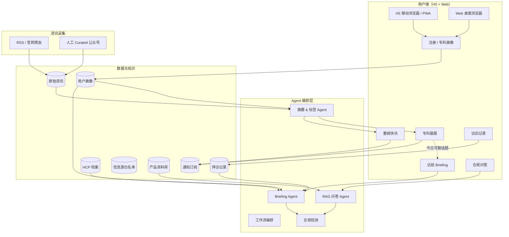
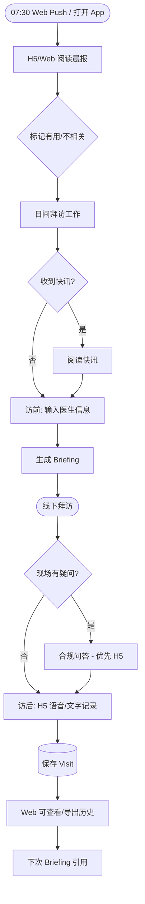
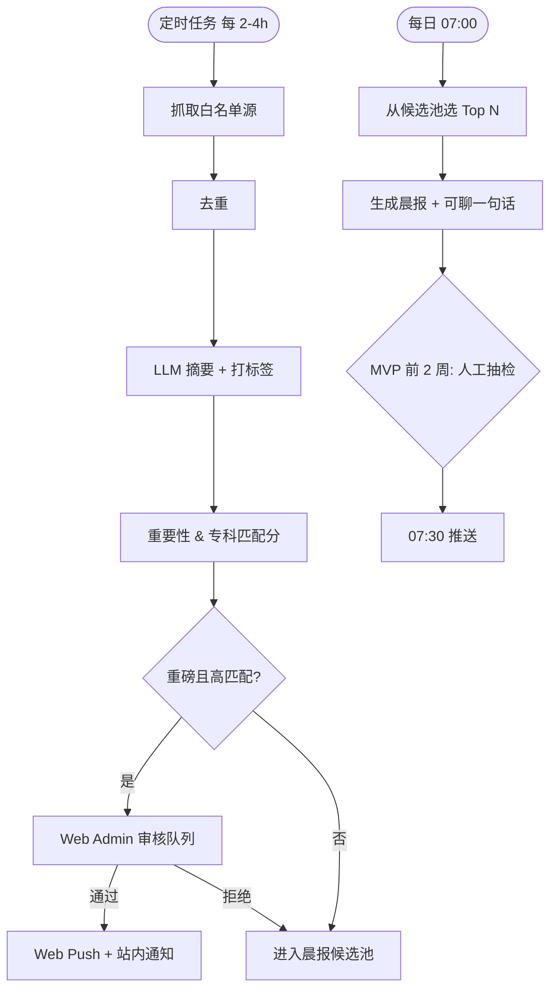
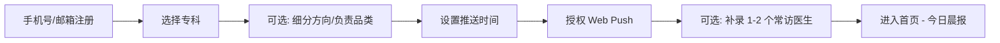
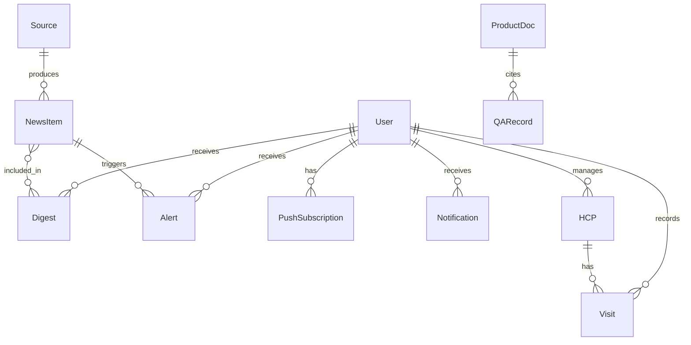

# RepPilot — 医药代表智能助手

- **版本**：v0.2
- **日期**：2026-07-06
- **状态**：有结论（产品层）
- **等级**：L2
- **关键词**：医药代表、Agent、H5、Web、访前 Briefing、专科晨报、合规问答、RAG

---

## 1. 背景与目标

### 用户原意

面向医药代表（初期以心内科等专科代表为主），打造一款 **Agent 驱动的日常工作助手**。代表每天需要掌握专科动态、准备拜访、回答医生提问、记录拜访结果；现有方式依赖手动刷公众号、翻资料、填 CRM，耗时长且信息分散。

**客户端策略（v0.2 修订）**：第一版 **不做微信小程序**，采用 **H5（移动浏览器）+ Web（桌面浏览器）双端**，共用同一后端 API。

### 要解决的问题

| 痛点 | 现状 | 产品应对 |
|------|------|----------|
| 信息过载 | 需关注大量公众号、期刊、政策 | **专科晨报 + 重磅快讯**，自动筛选摘要 |
| 访前准备耗时 | 20+ 分钟查资料、回忆历史 | **访前 Briefing**，5 分钟输出策略 |
| 现场答不上来 | 产品/临床知识更新快 | **合规问答**，基于企业资料 RAG |
| CRM 填报负担 | 访后手工录入 | **访后语音/文字 → 结构化记录** |
| 免费 AI 不可用 | ChatGPT 无合规边界、无行业上下文 | 合规内置 + 专科画像 + 工作流闭环 |

### 成功指标（MVP 验证期，2 周 × 10–20 种子用户）

| 指标 | 目标 |
|------|------|
| 周活跃（≥3 次/周） | ≥ 60% 种子用户 |
| 晨报打开率 | ≥ 50% |
| 访前准备省时感知 | ≥ 50% 用户反馈「明显省时」 |
| 付费意愿 | ≥ 30% 愿付 50–100 元/月或强意愿推荐 |
| 合规事故 | 0（无未审核材料作为事实输出） |

### 非目标（Out of Scope — 第一期）

- **微信小程序 / 微信登录 / 微信订阅消息**（后续版本可选）
- CRM / 企微深度双向集成
- 个体医生处方数据分析
- Territory 路线智能规划
- 经理团队看板 / To B 管理端（Admin 审核后台除外）
- 多专科同时上线（MVP 只做 1 个专科）
- 全自动抓取任意微信公众号
- 独立 Native App（H5 PWA 可「添加到主屏幕」，但不单独发 App Store）

---

## 2. 用户与场景

| 角色 | 场景 | 端 | 诉求 |
|------|------|-----|------|
| **医药代表** | 通勤路上 / 拜访间隙 | **H5** | 3–5 分钟读晨报、收快讯 |
| **医药代表** | 收到重磅新闻 | **H5** | Web Push / 站内通知及时触达 |
| **医药代表** | 拜访前准备 | **H5 / Web** | 手机快速生成 Briefing；桌面可深度编辑 |
| **医药代表** | 拜访途中 / 现场 | **H5** | 语音问答、快速查产品 |
| **医药代表** | 拜访结束后 | **H5** | 语音 30 秒记拜访 |
| **医药代表** | 晚间整理 / 办公室 | **Web** | 管理 HCP 列表、历史拜访、导出记录 |
| **运营/医学顾问** | 日常审核 | **Web** | 信息源管理、晨报/快讯审核队列 |
| **药企合规（Future）** | 采购评估 | **Web** | 审计导出、内容追溯 |

### 典型用户画像

- **用户 A**：心内科医药代表，负责 1–2 个 SKU，日常拜访三甲医院主治/副主任
- **移动场景**：手机浏览器打开 H5（可 PWA 添加到主屏幕）
- **桌面场景**：办公室用 Web 做 Briefing 准备、HCP 管理、资料查阅
- 每日拜访 2–4 个 HCP，每周需掌握专科新进展

### H5 vs Web 分工

| 维度 | H5（移动浏览器） | Web（桌面浏览器） |
|------|------------------|-------------------|
| **定位** | 外出高频、轻量操作 | 办公室深度操作 |
| **核心场景** | 晨报、快讯、访后语音、现场问答 | Briefing 编辑、HCP 管理、问答深聊、历史导出 |
| **布局** | 单列、底部 Tab、大按钮 | 侧边栏 + 多栏内容区 |
| **语音** | 主交互（MediaRecorder） | 可选，文字为主 |
| **推送** | Web Push（PWA）+ 站内通知 | Web Push + 站内通知 + 邮件摘要（可选） |
| **导航** | 首页 / 访前 / 问答 / 记录 / 我的 | 今日 / Briefing / HCP / 问答 / 资料 / 设置 |

---

## 3. 产品逻辑图

---

## 4. 功能模块详述

### 4.1 专科晨报（Daily Specialty Brief）— P0

**描述**：按用户专科画像，每日定时生成 5 条以内精选摘要。

**输入**：用户画像（专科、细分方向、关注类型、负责品类）

**输出结构**：
- 🔴 今日必看（1 条）
- 📌 值得关注（3–4 条）
- 📚 公众号精选（0–2 条，Curated）
- 💬 今日可聊的一句话（关联拜访场景）
- 每条：标题、3–5 bullet 摘要、来源链接、置信度

**触达方式（v1）**：
- **站内通知**：H5/Web 首页未读徽章 + 通知中心
- **Web Push**：用户授权后，07:30 浏览器推送（H5 PWA / Web 均支持）
- **邮件摘要（可选）**：未开启 Push 的用户 fallback

### 4.2 重磅快讯（Breakthrough Alert）— P0

**描述**：高重要性、高相关度资讯即时推送。

**触发规则（满足任意 2 条）**：
1. 重要性：指南发布/改写、III 期顶刊结果、NMPA 重大批准、国家级医保政策
2. 专科相关：与用户专科标签匹配分 ≥ 阈值
3. 时效：发布 ≤ 48 小时
4. 来源：白名单内

**限制**：每用户每日快讯上限 2 条；弱相关进次日晨报

**触达方式**：Web Push（即时）+ 站内通知列表；H5 端优先保证站内可见

### 4.3 访前 Briefing — P0

**描述**：拜访前生成个性化策略摘要。

**输入**：医生姓名 + 医院 + 科室 + 可选拜访目的

**输出**：
- 本次拜访目标（1–2 条）
- 谈话切入点（3 条）
- 常见异议 + 应答思路（2–3 组）
- 待跟进事项（来自历史拜访）
- 可关联今日晨报条目

**双端差异**：
- **H5**：选 HCP → 一键生成 → 复制/分享
- **Web**：同功能 + 可并排查看 HCP 历史 Visit、编辑 Briefing 备注

### 4.4 合规问答（Product Q&A）— P1

**描述**：基于企业已授权产品资料的 RAG 问答。

**输入**：自然语言问题

**输出**：
- 回答正文
- 引用来源（文档名 + 页码/段落）
- 合规提示（如涉及边界表述）
- 资料未覆盖时：明确告知 + 建议联系医学部

**双端差异**：
- **H5**：简洁对话，支持语音输入转文字
- **Web**：宽屏引用侧栏，可预览 PDF 来源段落

### 4.5 访后记录（Visit Log）— P1

**描述**：语音或文字输入 → 结构化拜访记录。

**输入**：30–60 秒语音（H5 MediaRecorder）或自由文本

**输出字段**：
- 拜访时间、对象（HCP）、医院科室
- 讨论话题、医生反馈/态度
- 异议与应对
- 下次行动项
- 一键复制到剪贴板（粘贴至微信/CRM/备忘录）

**飞轮**：记录沉淀 → 下次 Briefing 历史互动 → 晨报「今日可聊」更准

---

## 5. 主流程

### 5.1 每日主路径

### 5.2 资讯采集与发布流程

### 5.3 用户 Onboarding

---

## 6. 数据模型（逻辑层）

| 对象 | 关键字段 | 说明 |
|------|----------|------|
| **User** | id, phone/email, password_hash, specialty, sub_specialty[], product_tags[], push_time, alert_enabled, web_push_subscription | 用户与画像 |
| **PushSubscription** | id, user_id, endpoint, keys, platform(h5/web) | Web Push 订阅 |
| **Notification** | id, user_id, type, title, body, read_at, payload | 站内通知 |
| **HCP** | id, name, hospital, department, public_profile, tags[] | 医生档案 |
| **Visit** | id, user_id, hcp_id, visited_at, topics[], feedback, objections[], next_actions[], raw_input | 拜访记录 |
| **NewsItem** | id, title, url, source_id, published_at, specialty_tags[], importance_score, summary, status | 原始资讯 |
| **Digest** | id, user_id, date, items[], chat_tip, sent_at | 每日晨报 |
| **Alert** | id, user_id, news_item_id, sent_at, clicked | 快讯记录 |
| **Source** | id, name, url, type, specialty[], fetch_method, trust_level | 信息源白名单 |
| **ProductDoc** | id, product_name, file_url, version, approved_at, chunks[] | 产品资料（RAG） |
| **QARecord** | id, user_id, question, answer, citations[], compliance_flags[] | 问答审计 |

### 实体关系

---

## 7. 界面与交互要点

### 7.1 H5 页面清单（MVP）

| 页面 | 核心元素 |
|------|----------|
| **首页 / 今日** | 晨报卡片、未读快讯、通知铃铛、底部 Tab |
| **晨报详情** | 分条摘要、来源外链、有用/不相关 |
| **访前 Briefing** | 选 HCP → 生成 → 复制 |
| **合规问答** | 对话 UI、语音输入、引用折叠卡片 |
| **访后记录** | 按住录音 / 文本 → 预览 → 保存 |
| **我的** | 画像、推送设置、Web Push 授权引导 |
| **通知中心** | 晨报/快讯/系统通知列表 |

### 7.2 Web 页面清单（MVP）

| 页面 | 核心元素 |
|------|----------|
| **工作台** | 今日晨报 + 待办 + 快捷入口 |
| **访前 Briefing** | 左 HCP 列表 / 右 Briefing 结果，可打印/导出 |
| **HCP 管理** | 表格：医生、上次拜访、待办 |
| **合规问答** | 左对话 / 右引用与 PDF 预览 |
| **拜访历史** | 筛选、详情、导出 CSV |
| **设置** | 画像、通知、Push 管理 |
| **Admin（内部）** | 信息源、审核队列、资料上传 |

### 7.3 交互原则

- 单次核心任务 ≤ 3 步（H5 优先）
- 所有 AI 输出标注「AI 整理，以原文/官方材料为准」
- H5 语音优先；Web 文字与批量管理优先
- 响应式：窄屏自动降级为 H5 布局（可选同域名 `/m` 路径）
- 支持一键复制到剪贴板

### 7.4 双端路由策略

| 方案 | 说明 | MVP 建议 |
|------|------|----------|
| **同域双入口** | `app.reppilot.com`（Web）+ `m.reppilot.com`（H5） | ✅ 推荐 |
| **单 SPA 响应式** | 一套代码断点切换 | 备选，双端差异大时不优先 |
| **Monorepo 双 App** | `apps/web` + `apps/h5` 共享组件库 | ✅ 推荐 |

---

## 8. 边界情况

| 情况 | 期望行为 |
|------|----------|
| 信息源抓取失败 | 跳过该源，告警运维；晨报不少于 3 条则发送，否则发「今日暂无重磅」 |
| LLM 摘要与原文不符 | Admin 审核拦截；用户可「报告错误」 |
| 用户拒绝 Web Push | 仅站内通知 + 可选邮件；H5 引导「添加到主屏幕」 |
| iOS Safari Push 受限 | 站内通知为主；iOS 16.4+ PWA 可 Push，需检测并提示 |
| 合规问答无匹配资料 | 返回「资料库未覆盖」，不给猜测性回答 |
| 浏览器不支持录音 | 降级为文字输入 |
| 同一新闻多源重复 | 去重合并，保留最高 trust_level 来源 |
| 新用户无拜访历史 | Briefing 仅基于公开 HCP 信息 + 通用模板 |

---

## 9. 安全与边界

### 权限

- 用户仅可访问本人 Visit、Digest、QA、Notification
- Web Admin：独立角色 + 鉴权（运营/医学顾问）
- 产品资料库：用户只读；Admin 可 upload

### 数据

| 数据类型 | 存储 | 保留 | 可见性 |
|----------|------|------|--------|
| 用户账号/画像 | PostgreSQL | 账户存续 | 仅本人 |
| PushSubscription | PostgreSQL | 至用户取消 | 仅本人 |
| 拜访记录 | PostgreSQL | ≥ 2 年 | 仅本人 |
| 问答记录 | PostgreSQL | ≥ 2 年（审计） | 仅本人 |
| 语音原始文件 | 对象存储 | 30 天 | 仅本人 |

### 禁止项

- 编造临床数据、虚构文献引用
- 输出未批准适应症的推广性话术
- 未经授权抓取非公开处方/CRM 数据
- 第一版接入微信生态（登录、支付、订阅消息）— **除非用户后续明确要求**

### 待用户确认项

- [ ] 产品正式名称与品牌
- [ ] MVP 首发专科
- [ ] 注册方式：手机号验证码 vs 邮箱+密码
- [ ] 目标代码仓库路径
- [ ] 域名与 HTTPS 证书（Web Push 必需）
- [ ] 首发产品资料 PDF 来源

---

## 10. 分期路线图

| 阶段 | 周期 | 交付 | 目标 |
|------|------|------|------|
| **Phase 1 — MVP** | 4–6 周 | H5 + Web 双端、4 大功能、1 专科 | 验证留存与付费意愿 |
| **Phase 2 — 产品化** | 4–6 周 | PWA 增强、邮件推送、第 2 专科 | 提升 DAU |
| **Phase 3 — To B** | 8–12 周 | 企业资料库、审计、CRM 只读 | 药企试点 |
| **Future** | — | 微信小程序（可选） | 微信生态补充 |

---

## 11. 商业模式（摘要）

详见 [`../business/business.md`](../business/business.md)

---

## 12. 开放问题

1. H5 与 Web 是否共用同一域名路径，还是 `m.` 子域？
2. 注册是否必须手机号（国内代表更习惯）？
3. 邮件推送是否在 MVP 启用？

---

## 13. 关联

- 项目索引：[`../README.md`](../README.md)
- 技术架构：[`../tech/architecture.md`](../tech/architecture.md)
- 开发规划：[`../plans/plan.md`](../plans/plan.md)
- 商业分析：[`../business/business.md`](../business/business.md)
- 讨论记录：[`../ideas/2026-07-06-pharma-rep-agent.md`](../ideas/2026-07-06-pharma-rep-agent.md)
