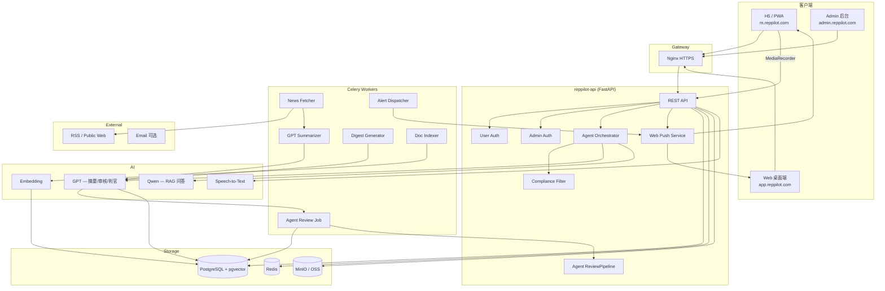
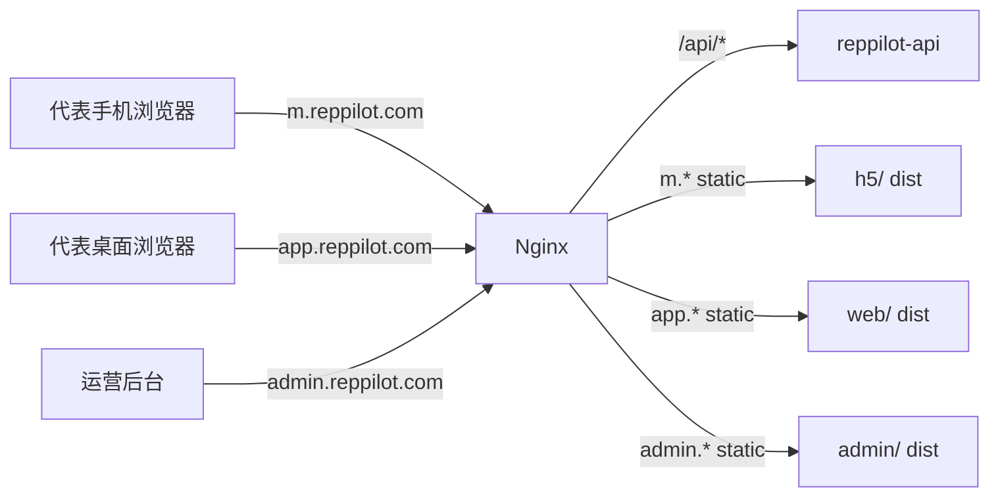
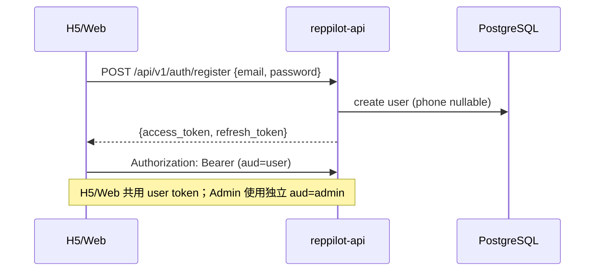
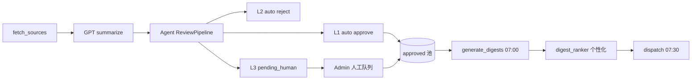
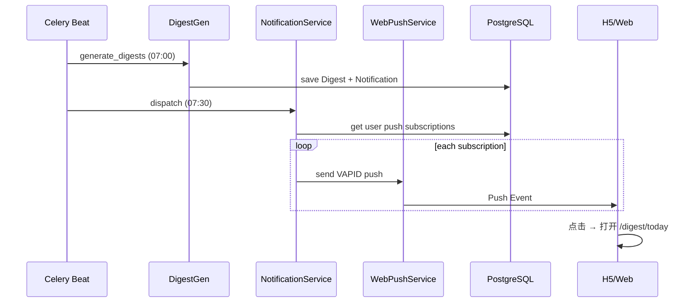
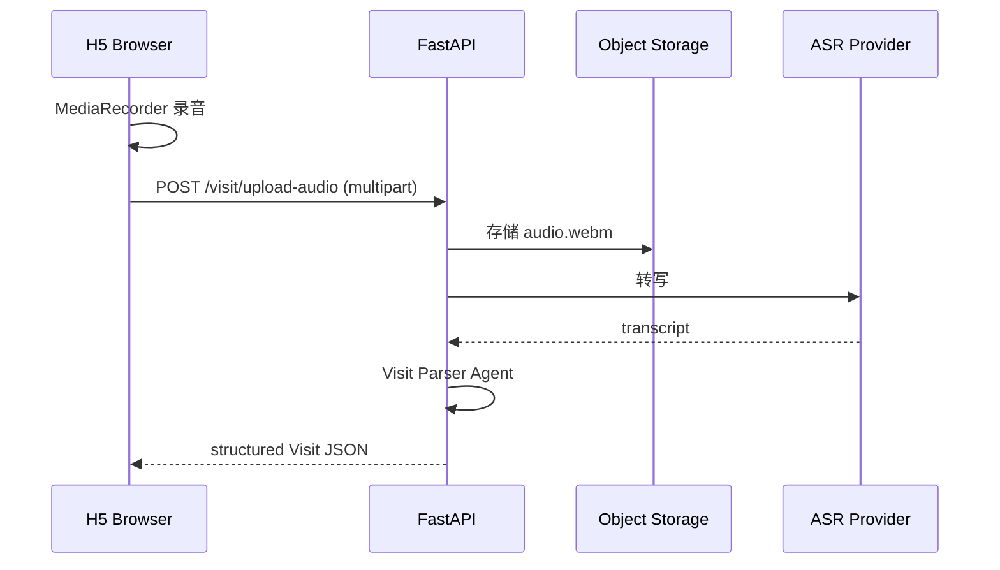
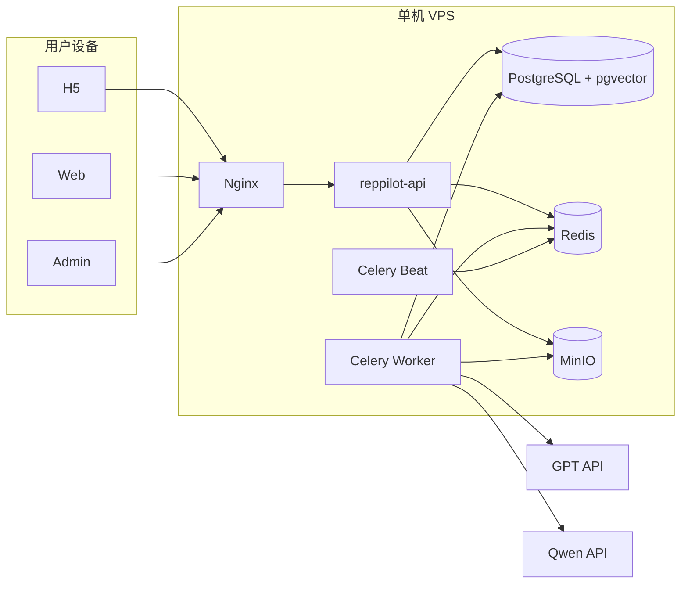

# RepPilot 技术架构

- **版本**：v0.3
- **日期**：2026-07-07
- **对应 Spec**：[`../product/spec.md`](../product/spec.md) · [`../product/admin-spec.md`](../product/admin-spec.md)
- **项目索引**：[`../README.md`](../README.md)
- **客户端**：H5（移动浏览器 / PWA）+ Web（桌面浏览器）+ Admin（独立域名），**不含微信小程序**
- **代码仓库**：前端 [`reppilot`](../../../reppilot)（h5 / web / admin）· 后端 **`reppilot-api`**（独立仓库，待创建）

---

## 1. 架构总览



---

## 2. 技术选型

### 2.1 选型原则

- **前后端分仓**：前端 `reppilot`（h5 / web / admin）· 后端 **`reppilot-api`**（FastAPI）
- **三端共享 API**：H5 / Web / Admin 共用 `reppilot-api`，Admin 独立 JWT
- **MVP 优先**：单体 FastAPI + Celery + **单机 Docker Compose**
- **Agent 审核降本**：ReviewPipeline 自动处理低风险；人工兜底高风险（见 Admin Spec §3.1）
- **Web 标准优先**：Web Push、MediaRecorder、PWA，不依赖微信 SDK

### 2.2 选型表

| 组件 | 选型 | 理由 | 备选 |
|------|------|------|------|
| **H5 端** | React 18 + Vite + Tailwind | 移动优先、PWA 成熟 | — |
| **Web 端** | React 18 + Vite + Tailwind | 桌面复杂布局 | — |
| **Admin 端** | React 18 + Vite + Tailwind | 独立域名、Ops Console 风格 | — |
| **前端仓库** | `reppilot` monorepo（h5/web/admin） | 三端 UI 分目录 | — |
| **后端仓库** | **`reppilot-api`** 独立仓库 | 与前端解耦、独立部署 | — |
| **API 框架** | FastAPI 0.110+ | 异步、OpenAPI | NestJS |
| **ORM** | SQLAlchemy 2 + Alembic | migration 成熟 | — |
| **主数据库** | PostgreSQL 15 + pgvector | 业务 + 向量一体 | — |
| **缓存/队列** | Redis 7 + Celery | 定时任务 | APScheduler |
| **摘要 / 审核** | **OpenAI GPT**（gpt-4o-mini 等） | 摘要 + Agent 判官 + 忠实度检查 | — |
| **RAG 问答** | **通义 Qwen**（qwen-max 等） | 中文医学 RAG | GPT-4o |
| **Embedding** | bge-m3 或 text-embedding-3-small | 中文医学 | — |
| **RAG 框架** | LangChain 或 LlamaIndex | 快速落地 | 自研 minimal |
| **爬虫** | httpx + feedparser + BS4 | RSS 为主 | Playwright |
| **ASR** | 阿里云语音识别 / Whisper API | 浏览器上传音频 | Web Speech API |
| **推送** | web-push (VAPID) | 标准 Web Push | 站内轮询（降级） |
| **用户认证** | JWT + **邮箱+密码**（MVP） | 简单落地 | 手机号 OTP（预留） |
| **Admin 认证** | 独立 JWT（`aud=admin`） | 与用户 token 隔离 | — |
| **对象存储** | MinIO（Compose）/ 阿里云 OSS | 语音/PDF | — |
| **反向代理** | Nginx | HTTPS 终结、静态资源 | Caddy |
| **Admin 部署** | `admin.reppilot.com` 独立静态 | 与用户端分离 | Web 内置路由（已废弃） |
| **MVP 部署** | **单机 Docker Compose** | 降成本、50 用户足够 | 云 RDS（Phase 2） |

### 2.3 明确不选（v1）

| 不选 | 原因 |
|------|------|
| 微信小程序 | 用户明确要求第一版不做 |
| 微信登录 / 订阅消息 | 同上 |
| uni-app 一套编译到小程序 | 与 v1 范围冲突 |
| Native App | MVP 用 PWA 替代 |
| 零人工全自动审核 | 医药场景安全底线（见 Admin Spec） |

### 2.4 LLM 使用场景

| 场景 | 模型 | 温度 |
|------|------|------|
| 新闻摘要 + 打标签 | **GPT** | 0.2 |
| Agent 审核 / 摘要忠实度 | **GPT** | 0.1 |
| 晨报「可聊一句话」 | **GPT** | 0.4 |
| Briefing 生成 | GPT / Qwen | 0.3 |
| **RAG 合规问答** | **Qwen** | 0.1 |
| Visit 结构化 | GPT | 0.1 |

---

## 3. 仓库与目录结构

### 3.1 前端 — `reppilot`

```
reppilot/
├── h5/                 # m.reppilot.com
├── web/                # app.reppilot.com
├── admin/              # admin.reppilot.com
└── README.md
```

### 3.2 后端 — `reppilot-api`（独立仓库）

```
reppilot-api/
├── app/
│   ├── api/
│   │   ├── v1/                 # 用户端 API
│   │   │   ├── auth.py
│   │   │   ├── profile.py
│   │   │   ├── digest.py
│   │   │   ├── alerts.py
│   │   │   ├── notifications.py
│   │   │   ├── push.py
│   │   │   ├── briefing.py
│   │   │   ├── qa.py
│   │   │   ├── visit.py
│   │   │   └── hcp.py
│   │   └── admin/v1/           # Admin API（独立 deps）
│   │       ├── auth.py
│   │       ├── dashboard.py
│   │       ├── review.py
│   │       ├── sources.py
│   │       ├── curated.py
│   │       ├── documents.py
│   │       ├── compliance.py
│   │       └── users.py
│   ├── auth/
│   │   ├── email_password.py   # MVP
│   │   └── phone_otp.py        # 预留 stub
│   ├── agents/
│   │   ├── summarizer.py       # GPT
│   │   ├── reviewer.py         # Agent ReviewPipeline
│   │   └── rag.py              # Qwen
│   ├── services/
│   │   ├── compliance.py
│   │   ├── web_push.py
│   │   ├── asr.py
│   │   ├── retrieval.py
│   │   └── digest_ranker.py    # product_tags + 反馈个性化
│   ├── models/
│   ├── schemas/
│   ├── tasks/
│   └── main.py
├── migrations/
├── docker-compose.yml          # api + worker + beat + pg + redis + minio
├── pyproject.toml
└── README.md
```

---

## 4. 双端架构设计

### 4.1 部署与路由



| 入口 | 构建产物 | 说明 |
|------|----------|------|
| `m.reppilot.com` | `reppilot/h5/dist` | 移动优先，PWA |
| `app.reppilot.com` | `reppilot/web/dist` | 桌面工作台 |
| `admin.reppilot.com` | `reppilot/admin/dist` | 运营后台（独立域名） |
| `*.reppilot.com/api` | `reppilot-api` | 共用 API |

### 4.2 三端能力矩阵

| 能力 | H5 | Web | Admin |
|------|----|-----|-------|
| 晨报/快讯阅读 | 卡片流 | 工作台模块 | — |
| 通知 | Web Push + 站内 | 同左 | — |
| 访后录音 | MediaRecorder | 文字为主 | — |
| Briefing | 简化向导 | 双栏 + 历史 | — |
| 问答 | 全屏对话 | 双栏 + PDF | — |
| HCP 管理 | 简单列表 | 表格 | — |
| 内容审核 | — | — | Agent + 人工队列 |
| 信息源/资料库 | — | — | CRUD + 发布 |

### 4.3 认证流程



**MVP**：邮箱 + 密码注册登录。  
**预留**：`users.phone`、`phone_verified_at`；`auth/phone_otp.py` stub，Phase 2 启用。

---

## 5. 资讯管线与 Agent 审核



**ReviewPipeline 检查器**：SourceTrust · UrlReachability · SummaryFaithfulness(GPT) · Compliance · SpecialtyTag · ImportanceCalibration

**安全底线**（详见 Admin Spec §3.1）：
- 快讯 MVP **始终 L3 人工**
- Curated **始终 L3 人工**
- Agent 失败/超时 → 降级 L3，不自动通过

---

## 6. 晨报个性化排序（Digest Ranker）

从 `approved` 候选池为**每位用户**生成 Top 5 + 1 headline，打分因子：

| 因子 | 权重（可调） |
|------|--------------|
| `importance_score` | 基础 ×0.4 |
| `product_tags` 交集 | +3 / 匹配 tag |
| 同来源历史 `useful` 反馈 | +2 |
| 同标签 `not_relevant` | -5 |
| 发布时间 | 指数衰减 |

`chat_tip` 由 GPT 基于 Top1 条目 + 用户 `product_tags` 生成。

---

## 7. 通知架构（替代微信订阅消息）



**降级策略**：

1. 有 PushSubscription → Web Push
2. 无 Push → 仅站内 Notification（下次打开可见）
3. Phase 2 → 邮件摘要 fallback

**H5 PWA 注意**：
- iOS 16.4+ 支持 PWA Web Push，需引导「添加到主屏幕」
- Android Chrome 直接支持
- Service Worker 需 HTTPS

## 8. 语音采集（H5）



**浏览器兼容**：
- Chrome Android / Desktop：✅
- Safari iOS：✅（需用户手势触发）
- 不支持时：降级文字输入

## 9. API 设计（MVP）

### 9.1 用户端 `/api/v1/`

| Method | Path | 说明 |
|--------|------|------|
| POST | `/auth/register` | 邮箱+密码注册 |
| POST | `/auth/login` | 登录 |
| POST | `/auth/refresh` | 刷新 token |
| GET/PATCH | `/profile` | 用户画像（specialty, product_tags, push_time） |
| POST | `/push/subscribe` | Web Push subscription |
| DELETE | `/push/subscribe` | 取消订阅 |
| GET | `/notifications` | 站内通知 |
| PATCH | `/notifications/{id}/read` | 标记已读 |
| GET | `/digest/today` | 今日晨报（个性化） |
| POST | `/digest/feedback` | useful / not_relevant |
| GET | `/alerts` | 未读快讯 |
| GET/POST | `/hcps` | 医生 CRUD |
| GET/POST | `/visits` | 拜访记录 |
| POST | `/briefing/generate` | 生成 Briefing |
| POST | `/qa/ask` | 合规问答（Qwen RAG） |
| POST | `/visit/upload-audio` | 上传录音 |
| POST | `/visit/transcribe` | 转写 + 结构化 |

### 9.2 Admin `/api/admin/v1/`（独立 JWT）

| Method | Path | 说明 |
|--------|------|------|
| POST | `/auth/login` | Admin 登录 |
| GET | `/dashboard` | 仪表盘（含 Agent 统计） |
| GET | `/review` | 审核队列（Tab: human/agent/feedback） |
| PATCH | `/review/{id}` | 人工通过/拒绝/改摘要 |
| POST | `/review/{id}/recall` | 超管撤回 Agent 通过 |
| CRUD | `/sources` | 信息源 |
| POST | `/curated` | Curated 入库 |
| CRUD | `/documents` | 资料库 |
| POST | `/documents/{id}/publish` | 超管发布 |
| CRUD | `/blocklist` | 禁用词 |
| GET | `/qa-logs` | 问答审计 |
| GET | `/users` | 用户列表 |
| GET | `/analytics` | 使用统计 |

---

## 10. 环境变量

```bash
# .env.example — reppilot-api

DATABASE_URL=postgresql+asyncpg://...
REDIS_URL=redis://...

# User JWT
JWT_USER_SECRET=
JWT_USER_EXPIRE_MINUTES=10080

# Admin JWT（与用户隔离）
JWT_ADMIN_SECRET=
JWT_ADMIN_EXPIRE_MINUTES=480

# GPT — 摘要 / 审核 / Briefing / Visit
LLM_SUMMARY_API_KEY=
LLM_SUMMARY_BASE_URL=https://api.openai.com/v1
LLM_SUMMARY_MODEL=gpt-4o-mini

# Qwen — RAG 问答
LLM_RAG_API_KEY=
LLM_RAG_BASE_URL=
LLM_RAG_MODEL=qwen-max

EMBEDDING_MODEL=bge-m3

# Agent 审核阈值（MVP env，Phase 2 Admin 可配）
REVIEW_L1_FAITHFULNESS_MIN=0.90
REVIEW_L3_CONFIDENCE_MAX=0.85
REVIEW_COLD_START_DAYS=14          # 冷启动期 100% 人工

# Web Push (VAPID)
VAPID_PUBLIC_KEY=
VAPID_PRIVATE_KEY=
VAPID_SUBJECT=mailto:ops@reppilot.com

# ASR
ASR_PROVIDER=aliyun
ALIYUN_ASR_KEY=

# Storage (Compose 默认 MinIO)
OSS_ENDPOINT=http://minio:9000
OSS_BUCKET=reppilot
OSS_ACCESS_KEY=
OSS_SECRET_KEY=

# App URLs
H5_BASE_URL=https://m.reppilot.com
WEB_BASE_URL=https://app.reppilot.com
ADMIN_BASE_URL=https://admin.reppilot.com

SENTRY_DSN=
```

---

## 11. 部署架构（MVP — 单机 Docker Compose）



**docker-compose 服务**：`api` · `worker` · `beat` · `postgres` · `redis` · `minio`

**Nginx 要点**：
- TLS 1.2+（Web Push 必需）
- `/api` 反代 `reppilot-api`
- 三域名分别 serve h5 / web / admin 静态资源

**预估月成本（MVP 单机）**：
- 云服务器 2C4G（含 PG/Redis/MinIO）：≈ 100–200 元
- GPT + Qwen API（50 用户）：≈ 200–600 元
- 域名 + 带宽：≈ 20–50 元

---

## 12. 非功能需求

| 维度 | MVP 目标 |
|------|----------|
| API P95 | < 2s（非 LLM） |
| Briefing 生成 | < 15s |
| H5 首屏 LCP | < 2.5s（4G） |
| Web 首屏 | < 1.5s（宽带） |
| 并发 | 50 用户 |
| 跨端登录 | 同一账号 H5/Web 共享 session |

---

## 13. 安全架构

- 全站 HTTPS（硬性）
- User / Admin **独立 JWT**（不同 secret 或不同 `aud`）
- JWT access 短过期 + refresh rotation
- CORS：仅允许 m / app / admin 三域名
- 对象存储 signed URL；语音 30 天自动清理
- Web Push subscription 与用户绑定
- Admin：角色校验 + 可选 IP 白名单
- **未经 approved 的 NewsItem 不得出现在用户 API**
- Agent 审核全量 audit log；快讯/Curated 不得 Agent 直出（MVP）

---

## 14. 开发顺序（MVP）

| 阶段 | 交付 |
|------|------|
| Week 1 | `reppilot-api` scaffold · migration · 邮箱认证 · 用户画像 API |
| Week 2 | 信息源 seed · 抓取 · GPT 摘要 · ReviewPipeline v0（规则） |
| Week 3 | GPT 忠实度检查 · Admin 三队列 · Digest 个性化 |
| Week 4 | 放开 L1 自动通过（仅晨报）；快讯仍 L3；Web Push |
| Week 5+ | Briefing · Visit · RAG(Qwen) · 联调 |

---

## 15. 关联

- 用户端 Spec：[`../product/spec.md`](../product/spec.md)
- Admin Spec：[`../product/admin-spec.md`](../product/admin-spec.md)
- Plan：[`../plans/plan.md`](../plans/plan.md)
- 前端仓库：[`reppilot`](../../../reppilot)
