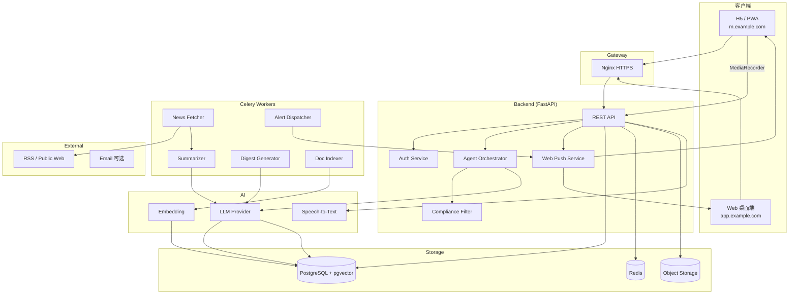
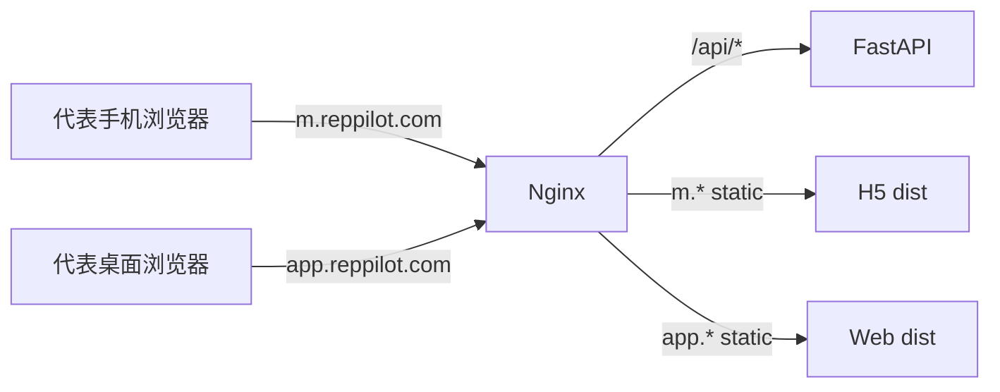
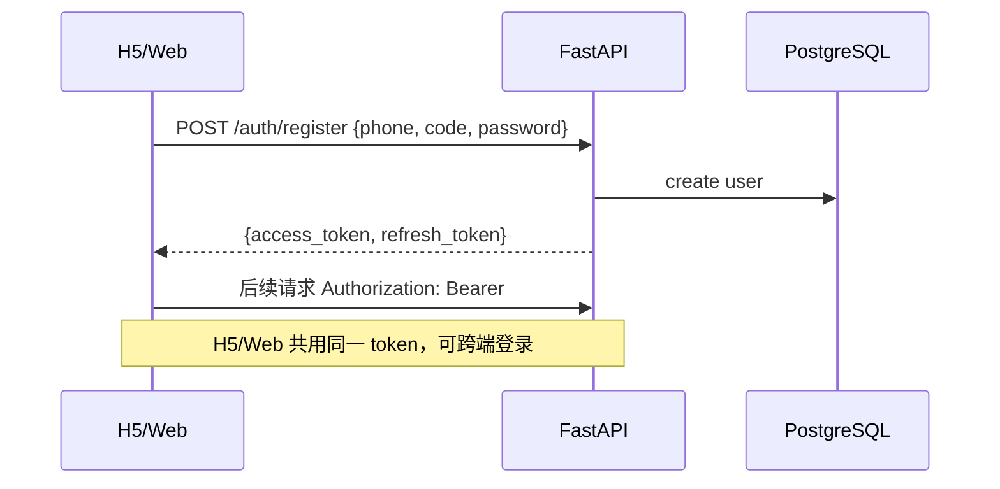
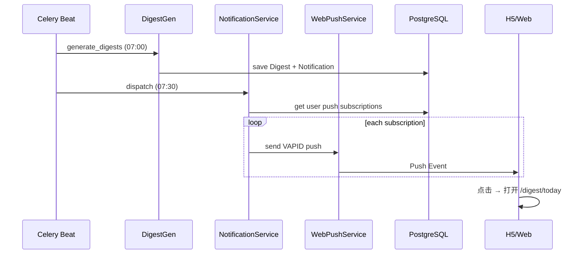
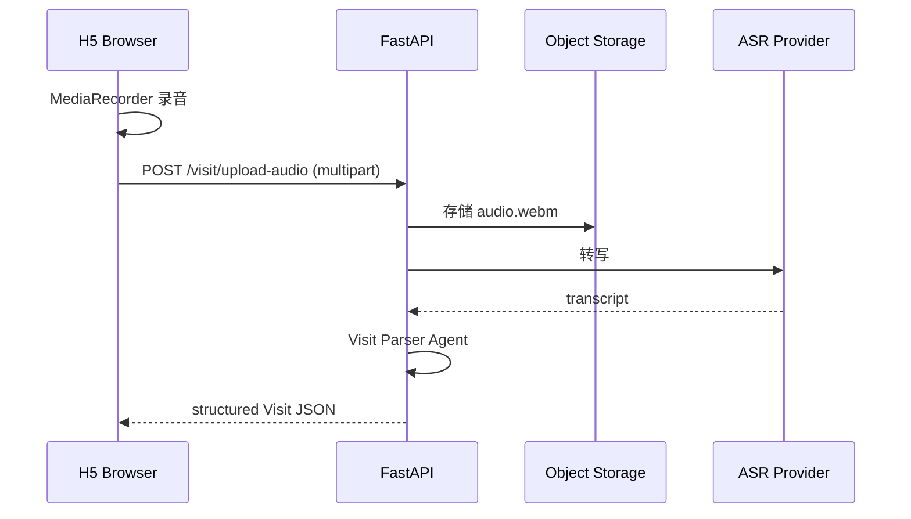
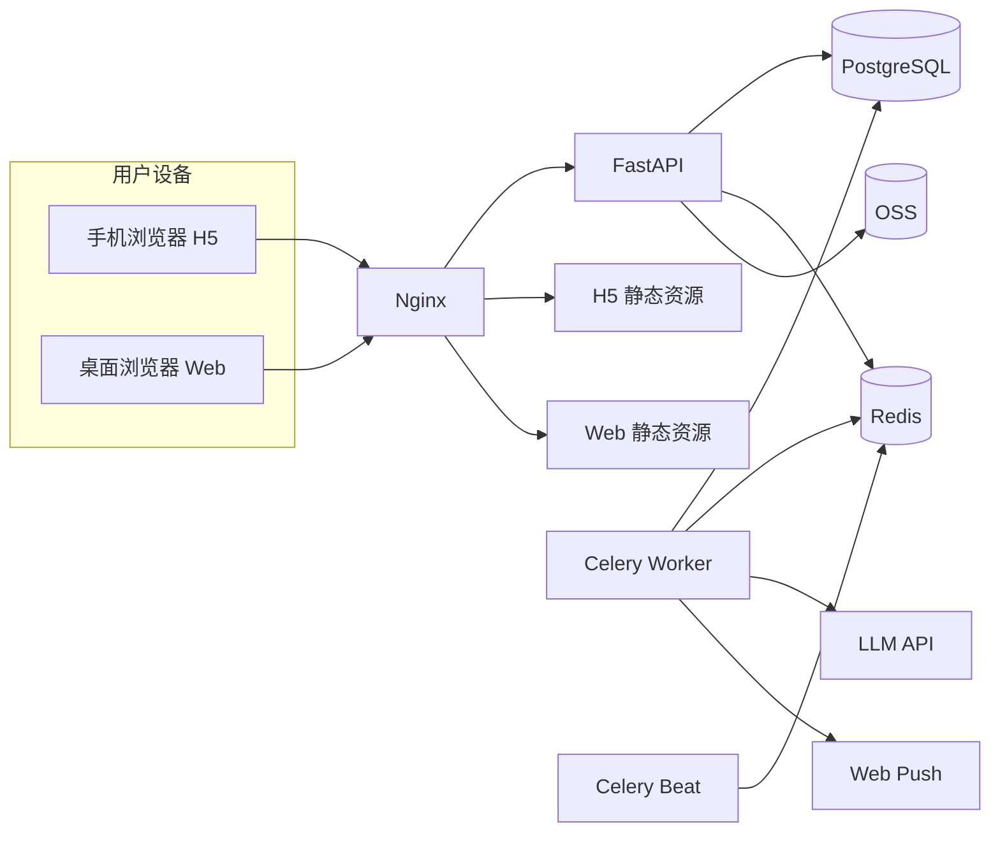

# RepPilot 技术架构

- **版本**：v0.2
- **日期**：2026-07-06
- **对应 Spec**：[`../product/spec.md`](../product/spec.md)
- **项目索引**：[`../README.md`](../README.md)
- **客户端**：H5（移动浏览器 / PWA）+ Web（桌面浏览器），**不含微信小程序**

---

## 1. 架构总览



---

## 2. 技术选型

### 2.1 选型原则

- **双端共享后端**：H5 / Web 共用 REST API，不重复业务逻辑
- **Monorepo 双 App**：移动端与桌面端 UI 分治，共享 `packages/shared`
- **MVP 优先**：单体 FastAPI + Celery
- **Web 标准优先**：Web Push、MediaRecorder、PWA，不依赖微信 SDK

### 2.2 选型表

| 组件 | 选型 | 理由 | 备选 |
|------|------|------|------|
| **H5 端** | React 18 + Vite + Tailwind | 移动优先、PWA 成熟 | Vue 3 + Vant |
| **Web 端** | React 18 + Vite + Tailwind + shadcn/ui | 桌面复杂布局 | Ant Design Pro |
| **Monorepo** | pnpm workspaces | shared 包复用 | Turborepo |
| **API 框架** | FastAPI 0.110+ | 异步、OpenAPI | NestJS |
| **ORM** | SQLAlchemy 2 + Alembic | migration 成熟 | — |
| **主数据库** | PostgreSQL 15 + pgvector | 业务 + 向量一体 | — |
| **缓存/队列** | Redis 7 + Celery | 定时任务 | APScheduler |
| **LLM** | DeepSeek / 通义 qwen-max | 中文摘要成本优 | GPT-4o |
| **Embedding** | bge-m3 或 text-embedding-3-small | 中文医学 | — |
| **RAG** | LangChain 或 LlamaIndex | 快速落地 | 自研 minimal |
| **爬虫** | httpx + feedparser + BS4 | RSS 为主 | Playwright |
| **ASR** | 阿里云语音识别 / Whisper API | 浏览器上传音频 | 浏览器 Web Speech API（备选，准确率较低） |
| **推送** | web-push (VAPID) | 标准 Web Push | 站内轮询（降级） |
| **认证** | JWT + 手机号/邮箱 | 无微信依赖 | Magic Link |
| **对象存储** | 阿里云 OSS / MinIO | 语音/PDF | — |
| **反向代理** | Nginx | HTTPS 终结、静态资源 | Caddy |
| **Admin** | Web 端内置 Admin 路由 | 与 Web 同栈 | Retool |

### 2.3 明确不选（v1）

| 不选 | 原因 |
|------|------|
| 微信小程序 | 用户明确要求第一版不做 |
| 微信登录 / 订阅消息 | 同上 |
| uni-app 一套编译到小程序 | 与 v1 范围冲突 |
| Native App | MVP 用 PWA 替代 |

### 2.4 LLM 使用场景

| 场景 | 推荐 | 温度 |
|------|------|------|
| 新闻摘要 + 打标签 | DeepSeek / qwen-max | 0.2 |
| 晨报「可聊一句话」 | 同上 | 0.4 |
| Briefing 生成 | qwen-max / GPT-4o | 0.3 |
| RAG 问答 | qwen-max / GPT-4o | 0.1 |
| Visit 结构化 | DeepSeek | 0.1 |

---

## 3. Monorepo 目录结构

```
rep-pilot/
├── backend/
│   ├── app/
│   │   ├── api/
│   │   │   ├── auth.py
│   │   │   ├── profile.py
│   │   │   ├── digest.py
│   │   │   ├── alerts.py
│   │   │   ├── notifications.py
│   │   │   ├── push.py          # Web Push 订阅
│   │   │   ├── briefing.py
│   │   │   ├── qa.py
│   │   │   ├── visit.py
│   │   │   ├── hcp.py
│   │   │   └── admin.py
│   │   ├── agents/
│   │   ├── services/
│   │   │   ├── compliance.py
│   │   │   ├── web_push.py      # 替代 wechat.py
│   │   │   ├── asr.py
│   │   │   └── retrieval.py
│   │   ├── models/
│   │   ├── schemas/
│   │   ├── tasks/
│   │   └── main.py
│   ├── migrations/
│   └── pyproject.toml
├── apps/
│   ├── h5/                       # 移动浏览器端
│   │   ├── src/
│   │   │   ├── pages/
│   │   │   ├── components/
│   │   │   ├── hooks/
│   │   │   │   └── useAudioRecorder.ts
│   │   │   └── sw.ts             # Service Worker
│   │   ├── public/manifest.json
│   │   └── vite.config.ts
│   └── web/                      # 桌面 Web 端
│       ├── src/
│       │   ├── pages/
│       │   ├── layouts/SidebarLayout.tsx
│       │   └── pages/admin/
│       └── vite.config.ts
├── packages/
│   └── shared/
│       ├── src/
│       │   ├── api/              # fetch wrapper
│       │   ├── types/
│       │   └── hooks/
│       └── package.json
├── docker-compose.yml
├── nginx.conf
└── README.md
```

---

## 4. 双端架构设计

### 4.1 部署与路由



| 入口 | 构建产物 | 说明 |
|------|----------|------|
| `m.reppilot.com` | `apps/h5/dist` | 移动优先，PWA |
| `app.reppilot.com` | `apps/web/dist` | 桌面工作台 + Admin |
| `*.reppilot.com/api` | FastAPI | 共用 API |

### 4.2 双端能力矩阵

| 能力 | H5 实现 | Web 实现 |
|------|---------|----------|
| 晨报/快讯阅读 | 卡片流 | 工作台模块 |
| 通知 | Web Push + 站内 + 徽章 | 同左 + 桌面 Notification API |
| 访后录音 | `MediaRecorder` 主路径 | 文字输入为主 |
| Briefing | 简化向导 | 双栏 + 历史 Visit |
| 问答 | 全屏对话 | 双栏 + PDF 预览 |
| HCP 管理 | 简单列表 | 表格 + 批量 |
| Admin | 不开放 | `/admin` 路由 |

### 4.3 认证流程



---

## 5. 通知架构（替代微信订阅消息）



**降级策略**：

1. 有 PushSubscription → Web Push
2. 无 Push → 仅站内 Notification（下次打开可见）
3. Phase 2 → 邮件摘要 fallback

**H5 PWA 注意**：
- iOS 16.4+ 支持 PWA Web Push，需引导「添加到主屏幕」
- Android Chrome 直接支持
- Service Worker 需 HTTPS

---

## 6. 语音采集（H5）



**浏览器兼容**：
- Chrome Android / Desktop：✅
- Safari iOS：✅（需用户手势触发）
- 不支持时：降级文字输入

---

## 7. API 设计（MVP）

| Method | Path | 说明 |
|--------|------|------|
| POST | `/auth/register` | 注册 |
| POST | `/auth/login` | 登录 |
| POST | `/auth/refresh` | 刷新 token |
| GET/PATCH | `/profile` | 用户画像 |
| POST | `/push/subscribe` | 注册 Web Push subscription |
| DELETE | `/push/subscribe` | 取消订阅 |
| GET | `/notifications` | 站内通知列表 |
| PATCH | `/notifications/{id}/read` | 标记已读 |
| GET | `/digest/today` | 今日晨报 |
| POST | `/digest/feedback` | 反馈 |
| GET | `/alerts` | 未读快讯 |
| GET/POST | `/hcps` | 医生 CRUD |
| GET/POST | `/visits` | 拜访记录 |
| POST | `/briefing/generate` | 生成 Briefing |
| POST | `/qa/ask` | 合规问答 |
| POST | `/visit/upload-audio` | 上传录音 |
| POST | `/visit/transcribe` | 转写 + 结构化 |
| GET/POST | `/admin/sources` | 信息源（Admin） |
| GET/PATCH | `/admin/news-items` | 审核队列（Admin） |

---

## 8. 环境变量

```bash
# .env.example
DATABASE_URL=postgresql+asyncpg://...
REDIS_URL=redis://...
JWT_SECRET=
JWT_EXPIRE_MINUTES=10080

# LLM
LLM_API_KEY=
LLM_BASE_URL=
LLM_MODEL=deepseek-chat
EMBEDDING_MODEL=bge-m3

# Web Push (VAPID)
VAPID_PUBLIC_KEY=
VAPID_PRIVATE_KEY=
VAPID_SUBJECT=mailto:ops@reppilot.com

# ASR
ASR_PROVIDER=aliyun  # or whisper
ALIYUN_ASR_KEY=

# Storage
OSS_ENDPOINT=
OSS_BUCKET=
OSS_ACCESS_KEY=
OSS_SECRET_KEY=

# Email (Phase 2 optional)
SMTP_HOST=
SMTP_USER=

# App URLs
H5_BASE_URL=https://m.reppilot.com
WEB_BASE_URL=https://app.reppilot.com

SENTRY_DSN=
ADMIN_API_KEY=
```

---

## 9. 部署架构（MVP）



**Nginx 要点**：
- TLS 1.2+（Web Push 必需）
- `/api` 反代 FastAPI
- 双域名分别 serve 两套静态资源
- gzip/brotli 压缩

**预估月成本**：
- 云服务器 2C4G：≈ 100–200 元
- PostgreSQL：≈ 100–300 元
- LLM：50 用户 ≈ 200–500 元
- OSS + 带宽：≈ 20–50 元

---

## 10. 非功能需求

| 维度 | MVP 目标 |
|------|----------|
| API P95 | < 2s（非 LLM） |
| Briefing 生成 | < 15s |
| H5 首屏 LCP | < 2.5s（4G） |
| Web 首屏 | < 1.5s（宽带） |
| 并发 | 50 用户 |
| 跨端登录 | 同一账号 H5/Web 共享 session |

---

## 11. 安全架构

- 全站 HTTPS（硬性）
- JWT access 短过期 + refresh rotation
- CORS：仅允许 H5/Web 域名
- CSP 头限制脚本来源
- 对象存储 signed URL
- Web Push subscription 与用户绑定，防跨用户推送
- Admin 路由：角色校验 + 可选 IP 白名单

---

## 12. 关联

- Spec：[`../product/spec.md`](../product/spec.md)
- Plan：[`../plans/plan.md`](../plans/plan.md)
